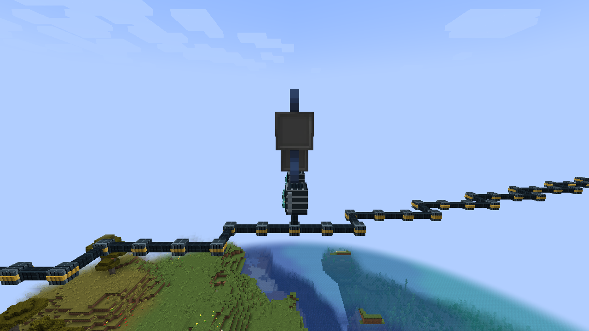

# Tech Village network

This is the network architecture of all ten Tech Villages, written for players who want
to check, join or extend it. The router CLI itself is described in [ROUTER.md](ROUTER.md);
how it was tested is in [TECH_VILLAGE_VALIDATION.md](TECH_VILLAGE_VALIDATION.md).
Tech Villages generate on Minecraft 1.21.1.

Commands in `code` blocks are typed **into a computer's terminal** unless they start
with `/`, which go in **Minecraft chat** (operator).

## 1. The ring at a glance

Ten villages sit around world spawn at radius 5000 (each moved to the nearest biome that
has vanilla villages). Village *N* is one autonomous system, **AS 65000+N**, run by its
ISP router. Neighbouring villages are joined by a long-distance fiber, so the ISPs form a
ring of eBGP sessions:

```
        AS65001 ── AS65002 ── AS65003 ── AS65004 ── AS65005
           │                                           │
        AS65010 ── AS65009 ── AS65008 ── AS65007 ── AS65006
```

Every ISP announces its two /24s. Village 1 also has the uplink to the host's internet
gateway and announces the default route. When one fiber is cut, traffic takes the long
way round the ring (up to nine AS hops); BGP reconverges within seconds because the
routers see the carrier drop. Every ISP also runs **open peering** on both of its fiber
links: tap a fiber with a patch panel and your own router can peer with the villages on
either side (section 10c).

Each village has:

* the **ISP**: a building in the village's style with a lattice mast; the ISP router
  (a terminal with an Interface Block: nine ports, eth0-eth8); two Fiber Patch Panels on the mast top;
* the **Data Center**: attached to the ISP's east side, with a rack row. The village web
  server lives there; in one village chosen by the world seed it also runs the ring's
  **chat server**;
* **houses**: about half of the residential houses (at least two) have a home router and
  a PC on a desk, cabled to the ISP under the streets.

## 2. Address plan

| Village | AS | ISP router ID | Village cable (ISP eth0) | Data center LAN (ISP eth1) | Web server | Fiber eth2 (to previous) | Fiber eth3 (to next) |
|---|---|---|---|---|---|---|---|
| 1 | 65001 | 100.65.0.1 | 100.65.1.0/24 | 100.65.0.0/24 | 100.65.0.10 | 172.31.10.2/28 to 10 | 172.31.1.1/28 to 2 |
| 2 | 65002 | 100.66.0.1 | 100.66.1.0/24 | 100.66.0.0/24 | 100.66.0.10 | 172.31.1.2/28 to 1 | 172.31.2.1/28 to 3 |
| 3 | 65003 | 100.67.0.1 | 100.67.1.0/24 | 100.67.0.0/24 | 100.67.0.10 | 172.31.2.2/28 to 2 | 172.31.3.1/28 to 4 |
| 4 | 65004 | 100.68.0.1 | 100.68.1.0/24 | 100.68.0.0/24 | 100.68.0.10 | 172.31.3.2/28 to 3 | 172.31.4.1/28 to 5 |
| 5 | 65005 | 100.69.0.1 | 100.69.1.0/24 | 100.69.0.0/24 | 100.69.0.10 | 172.31.4.2/28 to 4 | 172.31.5.1/28 to 6 |
| 6 | 65006 | 100.70.0.1 | 100.70.1.0/24 | 100.70.0.0/24 | 100.70.0.10 | 172.31.5.2/28 to 5 | 172.31.6.1/28 to 7 |
| 7 | 65007 | 100.71.0.1 | 100.71.1.0/24 | 100.71.0.0/24 | 100.71.0.10 | 172.31.6.2/28 to 6 | 172.31.7.1/28 to 8 |
| 8 | 65008 | 100.72.0.1 | 100.72.1.0/24 | 100.72.0.0/24 | 100.72.0.10 | 172.31.7.2/28 to 7 | 172.31.8.1/28 to 9 |
| 9 | 65009 | 100.73.0.1 | 100.73.1.0/24 | 100.73.0.0/24 | 100.73.0.10 | 172.31.8.2/28 to 8 | 172.31.9.1/28 to 10 |
| 10 | 65010 | 100.74.0.1 | 100.74.1.0/24 | 100.74.0.0/24 | 100.74.0.10 | 172.31.9.2/28 to 9 | 172.31.10.1/28 to 1 |

In general, for village *N* (with *P* the previous and *X* the next village):

| What | Address |
|---|---|
| Village cable | `100.(64+N).1.0/24`; ISP `100.(64+N).1.1`; DHCP pool `.10`-`.200` |
| Data center LAN | `100.(64+N).0.0/24`; ISP `100.(64+N).0.1`; web `.10`; chat `.20` (chat village only); DHCP pool `.100`-`.199` for computers you add to the racks |
| Fiber to the previous village | ISP eth2 `172.31.P.2/28`, the neighbour is `172.31.P.1` |
| Fiber to the next village | ISP eth3 `172.31.N.1/28`, the neighbour is `172.31.N.2` |
| Taps on a fiber | `.3`-`.14` of that link's /28 are free for players' routers (open peering) |
| Uplink (village 1 only) | ISP eth4 `10.0.0.2/24`, gateway `10.0.0.1` (NAT) |
| Home LANs (every house) | `192.168.1.0/24`, home router `192.168.1.1`, DHCP `.10`-`.200` |
| Chat server | `100.(64+K).0.20` port 7777, where K is the chat village (`/ecm techvillage info N` names it) |

Every house reuses `192.168.1.0/24`: each home LAN is its own segment behind NAT.

## 3. Computers, roles and ports

A terminal's network ports are its faces: the non-screen faces in the order DOWN, UP,
NORTH, SOUTH, WEST, EAST, then the free faces of attached Interface Blocks. For a
terminal with a horizontal screen, **DOWN is always eth0 and UP always eth1**; the side
faces depend on which way the screen faces, so use the Interface Probe on a face to see
its name.

| Role (identity) | Where | Ports | Services |
|---|---|---|---|
| ISP router (`isp.router`) | ISP, by the west wall | eth0 DOWN: village cable; eth1 UP: data center LAN; eth2: fiber to the previous village; eth3: fiber to the next; eth4-eth8 are the Interface Block's faces: eth4 is village 1's (logical) uplink, elsewhere spare like eth5-eth8, for peering | `router` (BGP with open peering on eth2/eth3, DHCP, NAT in village 1), `sshd` |
| Web server (`datacenter.web`) | Data Center, first rack | eth1 UP: data center LAN, `100.(64+N).0.10/24` | `httpd 80`, `sshd` |
| Chat server (`datacenter.chat`, one village) | Data Center, second rack | eth1 UP: `100.(64+N).0.20/24` | `chatd 7777`, `sshd` |
| Home router (`house<k>.router`) | house desk | eth0 DOWN: WAN on the village cable (DHCP, NAT outside); eth1 UP: home LAN `192.168.1.1/24` | `router` (DHCP server, NAT) |
| House PC (`house<k>.pc`) | house desk, beside the router | eth1 UP: home LAN by DHCP | - |

The ISP router, the web server and the chat server are **infrastructure**: they boot
headless when the server starts (before their terrain exists), keep running when their
chunks unload, and the generated blocks attach to the same running computers. House
computers boot when their chunks load. Each computer is provisioned with its startup
files (`router.cfg`, `network.cfg`, `services.cfg`, `/etc/chat.conf`, the website).
Existing files are kept, with one exception: infrastructure computers provisioned by an
older version of the mod (their `.ecm-provision` marker is missing or older) get the
current files once, so worlds from before the /28 plan are upgraded. Your later edits
(e.g. `write memory` on the ISP router) are kept, and house computers are never rewritten.

### There is no switch

The village has no Ethernet switch, and none is needed: **a cable mesh is one shared
segment**, like a hub. Every NIC whose face touches the same connected run of cable
hears every frame on it. So:

* the village cable under the streets is one segment: the ISP's eth0, every home
  router's WAN (eth0) and any computer a player plugs into it;
* the data center's cable is another: the ISP's eth1, the web server, the chat server
  and anything placed in a free rack;
* each fiber is a segment: one ISP's eth3, the next ISP's eth2, and any router a player
  has tapped into it;
* each house has its own tiny LAN segment: the patch cable over the home router's and
  the PC's UP faces.

The **home router** separates the house from the village: its WAN (eth0, DOWN) leases a
`100.(64+N).1.x` address from the ISP and is `ip nat outside`; its LAN (eth1, UP) is
`192.168.1.1/24`, `ip nat inside`, with a DHCP pool. Traffic from the PC leaves with the
router's WAN address, which is why every house can use the same private LAN.

## 4. Configurations

### ISP router (village 3; annotated)

`router.cfg` as provisioned (comments added here; `#` lines are not in the file):

```text
configure terminal
ip routing                                   # forward between ports
interface eth0                               # DOWN face: the village cable
ip address 100.67.1.1/24
exit
interface eth1                               # UP face: the data center LAN
ip address 100.67.0.1/24
exit
interface eth2                               # fiber to village 2 (previous); .3-.14 free for taps
ip address 172.31.2.2/28
exit
interface eth3                               # fiber to village 4 (next)
ip address 172.31.3.1/28
exit
dhcp-server vrf default
pool village                                 # leases for home routers and players on the village cable
range 100.67.1.10 100.67.1.200
default-router 100.67.1.1                    # picks the receiving interface (eth0)
dns-server 1.1.1.1
lease 86400
enable
exit
pool datacenter                              # leases for computers added to the free racks
range 100.67.0.100 100.67.0.199
default-router 100.67.0.1                    # eth1
dns-server 1.1.1.1
lease 86400
enable
exit
exit
ip prefix-list TAP-IN seq 10 deny 100.64.0.0/10 le 32     # from taps: no village ranges,
ip prefix-list TAP-IN seq 20 deny 172.31.0.0/16 le 32     # no ring links,
ip prefix-list TAP-IN seq 30 deny 0.0.0.0/0               # no default route,
ip prefix-list TAP-IN seq 40 permit 0.0.0.0/0 le 24       # only your own prefixes up to /24
route-map TAP-IN permit 10
match ip address prefix-list TAP-IN
exit
router bgp 65003
bgp router-id 100.67.0.1
timers bgp 10 30                             # keepalive/hold; a cut with no tap drops the carrier at once
neighbor 172.31.2.1 remote-as 65002          # previous village over eth2
neighbor 172.31.3.2 remote-as 65004          # next village over eth3
neighbor TAPS peer-group                     # open peering: anyone who taps either fiber
neighbor TAPS remote-as external             # any AS but 65003 (learned from the tap's OPEN)
neighbor TAPS listen ip-range 172.31.2.0/28 limit 8
neighbor TAPS listen ip-range 172.31.3.0/28 limit 8
address-family ipv4 unicast
neighbor 172.31.2.1 activate
neighbor 172.31.3.2 activate
neighbor TAPS activate
neighbor TAPS route-map TAP-IN in            # the safe import filter above
neighbor TAPS maximum-prefix 20              # more than 20 accepted prefixes: Cease, session down
network 100.67.0.0/24                        # announce the data center LAN
network 100.67.1.0/24                        # and the village cable
end
```

`services.cfg`: `router on` and `sshd &`. Village 1 additionally has

```text
interface eth0 / eth1 / eth2 / eth3
ip nat inside                                # everything behind village 1 is NATed...
interface eth4
ip address 10.0.0.2/24
ip nat outside                               # ...out of the uplink to the host gateway
ip route 0.0.0.0/0 10.0.0.1 eth4
network 0.0.0.0/0                            # (in address-family) announce the default to the ring
```

### Home router (annotated)

```text
configure terminal
ip routing
interface eth0                               # DOWN face: WAN on the village cable
ip dhcp                                      # lease 100.(64+N).1.x and a default route from the ISP
ip nat outside
exit
interface eth1                               # UP face: the home LAN (patch cable to the PC)
ip address 192.168.1.1/24
ip nat inside
exit
dhcp-server vrf default
pool lan
range 192.168.1.10 192.168.1.200
default-router 192.168.1.1
dns-server 1.1.1.1
lease 86400
enable
end
```

The house PC's `network.cfg` is `iface eth1 dhcp`; servers have static ones, e.g. the web
server `iface eth1 100.67.0.10/24` and `route default via 100.67.0.1 dev eth1`.

## 5. The fiber links, physically and logically

**Physically.** The mast top carries two Fiber Patch Panels, one on the side facing the
previous village and one on the side facing the next (the sides are fixed in world
coordinates when the ring is planned, so they do not depend on the building's random
rotation). Each long-distance fiber line starts on top of its panel and runs as a straight,
face-connected line of Fiber Span to the neighbour's panel, through hills and over
valleys. Inside the ISP, network cable runs from the router's eth2 face up the mast to
the "previous" panel and from its eth3 face to the "next" panel; the two runs never touch
each other, the village cable or the data center cable. A third run takes eth1 along the
ceiling, through the east wall and overhead into the Data Center, where it drops onto the
rack row.


**One wire, end to end.** The fiber is not simulated separately: router A's eth3, the
cable up the mast, the patch panel, the chord's Fiber Span, B's panel, B's cable and B's
eth2 form one cable segment, like any cable you lay yourself. So:

1. break any Fiber Span of the chord and the chord splits in two pieces at that block:
   each router is alone on its piece, loses carrier (no light from the far end), drops
   the BGP session at once and the ring reroutes; put a Fiber Span back in the same place
   and it is one piece again;
2. break any block of the cable up the mast and that router's port is cut off from its
   panel the same way; put a network cable back and it repairs;
3. `/ecm net cut A B` is a virtual break at the chord's midpoint (saved with the world),
   `/ecm net repair A B` removes it;
4. a **Fiber Patch Panel placed against any span** of the chord (on top of it or beside
   it) joins the piece it touches: whatever is cabled to the panel is on that fiber
   (section 10c). If the chord is broken, a tap stays with its side of the break.

The ring works everywhere, loaded or not: a chord is defined by the plan and the recorded
breaks, never walked block by block, so a 3500-block chord costs the same as a short one
(a full recompute takes about a millisecond). A village that has not been seen loaded yet
stands in as cabled at its chord end (and its data center as cabled to the router), so
the ring works headless from world creation. Once a village has been seen loaded, its
real cables decide; while unloaded, the saved last-known blocks do. Path blocks that
world generation could not write (bedrock, or a network block already there) count as
conducting: only removing a Fiber Span from the path breaks it. `/ecm net links` shows
each chord's pieces, breaks and taps.

**Your own fiber.** Fiber Span carries Ethernet for players too: put a Fiber Patch Panel
on a computer's face (or at the end of a cable), run Fiber Span from the top of that panel
to another panel, and the two sides are one segment, in loaded chunks and (with the
last-known topology) across unloaded ones. Fiber joins only fiber and patch panels: a
copper cable or a computer face touching a Fiber Span is not connected (use a panel). A
NIC has link only with a partner on its segment (another NIC or the internet gateway).
The `router_player_fiber` scenario (`/ecm scenario spawn router_player_fiber`) builds this
by hand and shows the cut and the copper control; `router_fiber_tap` taps a fiber between
two open-peering ISPs.

## 6. The Data Center

Every village has one, attached to the east side of the ISP (in the village's style).
Inside is a rack row: the web server in the first slot, the chat server in the second
(only in the chat village) and five free slots. The data center LAN cable runs over the
whole row, so **a computer you place in a free slot (screen facing the aisle) has its UP
face, eth1, on the LAN**. Give it `iface eth1 dhcp` in `network.cfg` (the ISP leases
`100.(64+N).0.100`-`.199`) or a static address in `100.(64+N).0.0/24` with gateway
`100.(64+N).0.1`, restart it, and it is reachable from every village.


## 7. The website

Each web server serves its village's page at `http://100.(64+N).0.10/` (also
`/index.html`): village number, style, AS, address ranges, fiber addresses, links to the
other nine villages' sites, and the chat server's address with how to use `chat`.
`httpd` serves `index.html` for `/` and the other files of the computer by name.

## 8. Chat

One village's data center (chosen from the world seed; `/ecm techvillage info N` names
it) runs `chatd 7777 &`. Every village computer has `/etc/chat.conf`:

```text
# Tech Village chat: run 'chat' (see 'chat --help')
server 100.74.0.20
port 7777
nick v3-house1
```

* `chat` connects to the server in `/etc/chat.conf` with its nick; `chat SERVER[:PORT]`
  or `--nick NAME` override it. A player's own computer without the file needs the
  address: `chat 100.(64+K).0.20`.
* Type and press Enter to talk; messages arrive above the line you are typing, with the
  server's time: `[16:18:40] <alice> hello bob`. New joiners get the last 20 messages.
* `/nick NAME`, `/who`, `/help`, `/quit` (Ctrl+T also quits).
* If it cannot connect it says why and how to fix it: no address (cable and DHCP), no
  route (default route), refused (no chatd on that port), no answer (check the path
  with ping/traceroute and BGP).


The protocol is one text line per message over TCP (`NICK`, `MSG`, `WHO`, `QUIT` from
clients; `WELCOME`, `MSG`, `HIST`, `JOIN`, `LEAVE`, `NICK`, `WHO`, `ERR` from the
server); see `rust/crates/ecm-chat/src/proto.rs`. A room takes 28 clients.

## 9. Verification runbook

The expected output below is copied from a test run (natural generation, seed
73198425, village 2 (plains) checking village 3 (desert); the chat server was in village 4).
In that run a player had tapped the 2-3 fiber just before (section 10c: AS 65202, LAN
`10.200.2.0/24` at `172.31.2.5`), so it shows up as a dynamic neighbor; without a tap
those lines are absent. Addresses and timings differ per village.

### On an ISP router

Stand at the ISP router (or `ssh` to it), then:

```text
router
show bgp ipv4 unicast summary
show bgp ipv4 unicast
show ip route
show arp
exit
ping 100.67.0.10 -n 2
traceroute 100.67.0.10
curl http://100.67.0.10/
```

`router` opens the router CLI (`router#`). Expected, on village 2's ISP:

```text
router# show bgp ipv4 unicast summary
VRF : default
BGP Summary
-----------
 Local AS               : 65002        BGP Router Identifier  : 100.66.0.1
 Peers                  : 3            Dynamic Peers          : 1
 Cfg. Hold Time         : 30           Cfg. Keep Alive        : 10

 Neighbor         Remote-AS   MsgRcvd  MsgSent  Up/Down Time  State        AdminStatus  PfxRcd
 172.31.1.1       65001       58       44       00h:01m:37s   Established  Up           11
 172.31.2.2       65003       88       77       00h:00m:22s   Established  Up           11
*172.31.2.5       65202       14       23       00h:00m:01s   Established  Up           1

* - dynamic neighbor (listen ip-range)
Listen range 172.31.1.0/28 peer-group TAPS: 0 dynamic neighbor(s), limit 8
Listen range 172.31.2.0/28 peer-group TAPS: 1 dynamic neighbor(s), limit 8
```

Both fiber neighbours must be `Established`: the previous village on eth2's /28
(`172.31.(N-1).1`) and the next on eth3's (`172.31.N.2`). `PfxRcd` counts the prefixes
received: village 1 adds the default route, and village 3 passes on the tap's /24. Lines
starting with `*` are taps (dynamic neighbors, section 10c). A neighbour stuck in `Active`/`Connect`
means that fiber link is down: see `/ecm net links`.

```text
router# show bgp ipv4 unicast
0.0.0.0/0 via 172.31.1.1 AS_PATH [65001] local-pref 100 MED 0 community
10.200.2.0/24 via 172.31.2.5 AS_PATH [65202] local-pref 100 MED 0 community
100.65.0.0/24 via 172.31.1.1 AS_PATH [65001] local-pref 100 MED 0 community
100.65.1.0/24 via 172.31.1.1 AS_PATH [65001] local-pref 100 MED 0 community
100.66.0.0/24 via 0.0.0.0 AS_PATH [] local-pref 100 MED 0 community
100.66.1.0/24 via 0.0.0.0 AS_PATH [] local-pref 100 MED 0 community
100.67.0.0/24 via 172.31.2.2 AS_PATH [65003] local-pref 100 MED 0 community
100.67.1.0/24 via 172.31.2.2 AS_PATH [65003] local-pref 100 MED 0 community
100.68.0.0/24 via 172.31.2.2 AS_PATH [65003, 65004] local-pref 100 MED 0 community
100.68.1.0/24 via 172.31.2.2 AS_PATH [65003, 65004] local-pref 100 MED 0 community
100.69.0.0/24 via 172.31.2.2 AS_PATH [65003, 65004, 65005] local-pref 100 MED 0 community
100.69.1.0/24 via 172.31.2.2 AS_PATH [65003, 65004, 65005] local-pref 100 MED 0 community
100.70.0.0/24 via 172.31.2.2 AS_PATH [65003, 65004, 65005, 65006] local-pref 100 MED 0 community
100.70.1.0/24 via 172.31.2.2 AS_PATH [65003, 65004, 65005, 65006] local-pref 100 MED 0 community
100.71.0.0/24 via 172.31.1.1 AS_PATH [65001, 65010, 65009, 65008, 65007] local-pref 100 MED 0 community
100.71.1.0/24 via 172.31.1.1 AS_PATH [65001, 65010, 65009, 65008, 65007] local-pref 100 MED 0 community
100.72.0.0/24 via 172.31.1.1 AS_PATH [65001, 65010, 65009, 65008] local-pref 100 MED 0 community
100.72.1.0/24 via 172.31.1.1 AS_PATH [65001, 65010, 65009, 65008] local-pref 100 MED 0 community
100.73.0.0/24 via 172.31.1.1 AS_PATH [65001, 65010, 65009] local-pref 100 MED 0 community
100.73.1.0/24 via 172.31.1.1 AS_PATH [65001, 65010, 65009] local-pref 100 MED 0 community
100.74.0.0/24 via 172.31.1.1 AS_PATH [65001, 65010] local-pref 100 MED 0 community
100.74.1.0/24 via 172.31.1.1 AS_PATH [65001, 65010] local-pref 100 MED 0 community
```

**One village is properly peered with the others** when its table has all twenty
village /24s (its own two with an empty AS path) plus any taps' prefixes, each remote
village reached the short way round (the AS path is the list of villages in between; never longer than
five ASes on an intact ring), and `0.0.0.0/0` from AS 65001.

```text
router# show ip route
100.66.1.0/24 via 0.0.0.0 dev eth0 Connected [0/0]
100.66.0.0/24 via 0.0.0.0 dev eth1 Connected [0/0]
172.31.1.0/28 via 0.0.0.0 dev eth2 Connected [0/0]
172.31.2.0/28 via 0.0.0.0 dev eth3 Connected [0/0]
0.0.0.0/0 via 172.31.1.1 dev eth2 Bgp [20/1]
10.200.2.0/24 via 172.31.2.5 dev eth3 Bgp [20/1]
100.65.0.0/24 via 172.31.1.1 dev eth2 Bgp [20/1]
100.65.1.0/24 via 172.31.1.1 dev eth2 Bgp [20/1]
100.67.0.0/24 via 172.31.2.2 dev eth3 Bgp [20/1]
100.67.1.0/24 via 172.31.2.2 dev eth3 Bgp [20/1]
100.68.0.0/24 via 172.31.2.2 dev eth3 Bgp [20/2]
...
100.74.0.0/24 via 172.31.1.1 dev eth2 Bgp [20/2]
100.74.1.0/24 via 172.31.1.1 dev eth2 Bgp [20/2]
```

Four connected routes (eth0 village cable, eth1 data center, eth2/eth3 fiber) and the
BGP routes installed with distance 20 and the AS-path length as metric.

```text
router# show arp
100.66.1.10 02:00:a1:32:53:3c Reachable
100.66.0.10 02:01:93:24:56:3d Reachable
172.31.1.1 02:03:a4:ce:a1:38 Reachable
172.31.2.2 02:02:03:ec:3a:3d Reachable
router# exit
```

A home router on the village cable (`100.66.1.10`), the web server on the data center
LAN (`100.66.0.10`), and both fiber neighbours. Back in the shell:

```text
/ > ping 100.67.0.10 -n 2
PING 100.67.0.10 (100.67.0.10) - 2 packets
Reply from 100.67.0.10: bytes=40 time=1ms seq=0
Reply from 100.67.0.10: bytes=40 time=1ms seq=1
--- 100.67.0.10 ping statistics ---
2 packets sent, 2 received
/ > traceroute 100.67.0.10
traceroute to 100.67.0.10 (100.67.0.10), 30 hops
1  172.31.2.2
2  100.67.0.10
```

`curl http://100.67.0.10/` prints village 3's page (shown below).

### On a house PC

```text
ifconfig
ip route
cat /etc/chat.conf
ping 100.67.0.10 -n 2
traceroute 100.67.0.10
curl http://100.67.0.10/
```

Expected, on village 2's first house PC:

```text
/ > ifconfig
eth0: flags=<UP>  mtu 1500
      ether 02:00:9b:e4:af:31
eth1: flags=<UP>  mtu 1500
      ether 02:01:9b:e4:af:31
      inet 192.168.1.10/24
...
/ > ip route
192.168.1.0/24 dev eth1 scope link proto connected
default via 192.168.1.1 dev eth1 proto dhcp
/ > cat /etc/chat.conf
# Tech Village chat: run 'chat' (see 'chat --help')
server 100.68.0.20
port 7777
nick v2-house1
/ > ping 100.67.0.10 -n 2
PING 100.67.0.10 (100.67.0.10) - 2 packets
Reply from 100.67.0.10: bytes=40 time=2ms seq=0
Reply from 100.67.0.10: bytes=40 time=1ms seq=1
--- 100.67.0.10 ping statistics ---
2 packets sent, 2 received
/ > traceroute 100.67.0.10
traceroute to 100.67.0.10 (100.67.0.10), 30 hops
1  192.168.1.1
2  100.66.1.1
3  172.31.2.2
4  100.67.0.10
```

The PC leased `192.168.1.x` on its UP face (eth1) from the home router; the hops are the
home router, village 2's ISP (its village-cable address), village 3's ISP (its fiber
address) and village 3's web server. With the 2-3 fiber (or the cable up either mast)
cut, the same traceroute takes the long way: 12 hops through villages 1, 10, 9, ... 4.

```text
/ > curl http://100.67.0.10/
<!DOCTYPE html>
<html><head><title>Tech Village 3 - AS 65003</title></head>
<body>
<h1>Tech Village 3</h1>
<p>A desert village on the Tech Village fiber ring. AS 65003, served from the village data center.</p>
<h2>Network</h2>
<ul>
<li>Village cable (ISP eth0): 100.67.1.0/24, gateway 100.67.1.1, DHCP .10-.200: plug any computer in and use 'iface ethN dhcp'</li>
<li>Data center LAN (ISP eth1): 100.67.0.0/24, gateway 100.67.0.1; this web server 100.67.0.10; free racks get DHCP .100-.199</li>
<li>Fiber: eth2 172.31.2.2/28 to village 2 (AS 65002), eth3 172.31.3.1/28 to village 4 (AS 65004)</li>
<li>Open peering on both fiber links: tap a span with a patch panel, take a free address .3-.14 in that link's /28 and peer from any AS (eBGP; up to 20 of your own prefixes, /24 or shorter)</li>
<li>Spare ports for peering: eth5-eth8</li>
</ul>
<h2>Chat</h2>
<p>The ring's chat server runs in the data center of village 4: 100.68.0.20 port 7777.</p>
<p>Run <code>chat</code> (village computers read /etc/chat.conf) or <code>chat 100.68.0.20</code>. Type to talk; /nick NAME, /who, /quit.</p>
<h2>Other villages</h2>
<ul>
<li><a href="http://100.65.0.10/">Tech Village 1</a> (plains, AS 65001)</li>
...
<li><a href="http://100.74.0.10/">Tech Village 10</a> (plains, AS 65010)</li>
</ul>
</body></html>
```

### Chat

```text
chat
```

On village 2's house PC (left) and village 3's (right), typing a line on each and
`/who` on the second:

```text
/ > chat
chat: connecting to 100.68.0.20:7777 as v2-house1 ...
*** Joined Tech Village chat as v2-house1 (/help for commands)
[16:39:45] * you joined
[16:39:45] * v3-house1 joined
[16:39:45] <v2-house1> hello from village 2
[16:39:45] <v3-house1> hi from village 3, see you on the ring
>
```

```text
/ > chat
chat: connecting to 100.68.0.20:7777 as v3-house1 ...
*** Joined Tech Village chat as v3-house1 (/help for commands)
[16:39:45] * you joined
[16:39:45] <v2-house1> hello from village 2
> /who
*** 2 online: v2-house1, v3-house1
[16:39:45] <v3-house1> hi from village 3, see you on the ring
>
```

The chat server's own screen logs every connection
(`v2-house1 joined from 100.66.1.10:...`: the house's home router address, after NAT).
A wrong address or port fails with a hint instead, for example:

```text
/ > chat 100.65.0.10
chat: connecting to 100.65.0.10:7777 as v5-web ...
chat: connection to 100.65.0.10:7777 refused: the computer answered but no chat server listens there.
  Fix: on the chat server run 'chatd &' (it is in its services.cfg), or check the port.
```

### In Minecraft chat

```text
/ecm net links
/ecm techvillage info 3
/ecm techvillage list
/ecm headless list
```

```text
/ecm net links
1-2: connected, carrier up; 4112 blocks in 1 piece(s); 1 eth3 not generated (stands in as cabled), 2 eth2 cabled
2-3: connected, carrier up; 4277 blocks in 1 piece(s); 2 eth3 cabled, 3 eth2 cabled
  tap at 4416 115 -1552 (block 2138, piece 1; 3 NIC(s) on that segment)
3-4: connected, carrier up; 3787 blocks in 1 piece(s); 3 eth3 cabled, 4 eth2 not generated (stands in as cabled)
4-5: connected, carrier up; 3580 blocks in 1 piece(s); 4 eth3 not generated (stands in as cabled), 5 eth2 not generated (stands in as cabled)
...
1-10: connected, carrier up; 3122 blocks in 1 piece(s); 10 eth3 not generated (stands in as cabled), 1 eth2 not generated (stands in as cabled)
topology: 27 recomputes, last 0.87 ms (2321 blocks read), worst 10.89 ms

/ecm techvillage info 2
Village 2 (plains): AS 65002, ISP at 3904, -3152
  village cable (ISP eth0): 100.66.1.0/24, gateway .1, DHCP .10-.200: plug any computer into it
  data center LAN (ISP eth1): 100.66.0.0/24; web server 100.66.0.10; free racks DHCP .100-.199
  fiber eth2 -> village 1 (172.31.1.2/28, open peering): panel 3903, 140, -3152 (west of the mast), cabled
  fiber eth3 -> village 3 (172.31.2.1/28, open peering): panel 3904, 140, -3151 (south of the mast), cabled
  taps: put a Fiber Patch Panel against a span, use a free .3-.14 in that link's /28, peer with 172.31.1.2 / 172.31.2.1 (AS 65002)
  chat server of the ring: village 4, 100.68.0.20 port 7777
  router 29559aec-146a-3832-bd21-7b10e2d2f505, web 316e4e93-2456-3db6-b57e-7da852fe61a2

/ecm techvillage list
Village 1 AS 65001 (plains) at 1472, -4832; fiber endpoint y 142
Village 2 AS 65002 (plains) at 3904, -3152; fiber endpoint y 141
Village 3 AS 65003 (desert) at 4928, 48; fiber endpoint y 87
...
```

Every chord should read `connected, carrier up` with one piece. An end reads `not
generated (stands in as cabled)` until that village has been seen loaded, `cabled` when
the router's port is on its chord's segment, `CABLE CUT` when the in-building cable is
broken, and `(unloaded, last known)` when judged from the saved topology. A broken chord
lists its breaks (`span missing at X Y Z (block N)` or `admin cut`) and has two or more
pieces; a chord broken between two routers reads `CUT, no carrier`. Taps are listed
under their chord with the piece they sit on. The last line is the cost of the topology
recomputes (at most one per tick).

`/ecm net cut A B` and `/ecm net repair A B` take one ring edge down and up
administratively (neighbours only); watch the routers' `show bgp ipv4 unicast summary`
and a `traceroute` change, then repair it.

## 10. Joining the network

### (a) A computer as a customer

* **On the village cable.** Dig down one block under a street (or start at a home
  router's DOWN face): that is the village cable. Put your computer so one of its faces
  touches it (or run cable from the face to it), find that face's name with the Interface
  Probe, put `iface ethN dhcp` in `network.cfg` and restart. You lease a
  `100.(64+N).1.x` address with the ISP as gateway and reach every village, the chat
  server and, through village 1, the internet gateway. Check with `ifconfig`,
  `ip route`, `ping 100.(64+N).1.1 -n 2`, `curl http://100.(64+M).0.10/`, `chat`.
* **Behind your own home router.** Cable your router's WAN to the village cable and give
  it the home router configuration from section 4 (`ip dhcp` + `ip nat outside` on the
  WAN, a private LAN with a DHCP pool and `ip nat inside`); your PCs use
  `iface ethN dhcp` on the LAN.
* **In the data center.** Place it in a free rack (section 6).

### (b) Your own AS peering with an ISP

Use one of the ISP router's spare ports, eth5-eth8 (faces of the Interface Block beside
it; eth4 is also free outside village 1). Right-click the ISP router's faces with the **Interface
Probe** to see which face is which port, cable that face to your router's port, and pick
a free /30 and AS number (here village 3, port eth5, `172.30.3.0/30`, your AS 65200 and
LAN `10.200.0.0/24`).

On the **ISP router** (village 3):

```text
router
configure terminal
interface eth5
ip address 172.30.3.1/30
exit
router bgp 65003
neighbor 172.30.3.2 remote-as 65200
address-family ipv4 unicast
neighbor 172.30.3.2 activate
end
write memory
exit
```

On **your router** (its eth1 cabled to the ISP's eth5, its eth0 your LAN):

```text
router on
router
configure terminal
ip routing
interface eth0
ip address 10.200.0.1/24
exit
interface eth1
ip address 172.30.3.2/30
exit
router bgp 65200
bgp router-id 10.200.0.1
neighbor 172.30.3.1 remote-as 65003
address-family ipv4 unicast
neighbor 172.30.3.1 activate
network 10.200.0.0/24
end
write memory
exit
```

Originate only prefixes you really have configured (`network` needs a matching
connected or static route) and that nobody else uses: not `100.64.0.0/10`-style
village ranges, not `172.31.0.0/16`. Your PCs use `10.200.0.x/24` with gateway
`10.200.0.1`.

Verify: on your router `show bgp ipv4 unicast summary` shows `172.30.3.1` as
`Established`; `show bgp ipv4 unicast` lists the twenty village /24s (and `0.0.0.0/0`
from village 1); on any ISP router `show ip route` has `10.200.0.0/24` via village 3;
from a PC on your LAN `ping 100.65.0.10 -n 2`, `traceroute 100.70.0.10`,
`curl http://100.65.0.10/` and `chat 100.(64+K).0.20` work. Without the ISP's console,
tap a fiber instead (below): the ISPs accept dynamic neighbors there.

### (c) Tapping the ring

If you come across the fiber between two villages, you can splice into it and peer with
whoever is on it, no operator needed: every ISP runs open peering on both of its fiber
links. Here: the fiber between village 3 and village 4, your AS 65203, your LAN
`10.200.3.0/24`.

**1. Find a span and tap it.** Any Fiber Span of the line works (`/ecm techvillage info 3`
names the panels at its ends; the line runs straight between them). Place a **Fiber Patch
Panel against the span**, on top of it or beside it. Then a network cable on the panel and
your router on that cable (or the router directly on the panel), so that one of the
router's faces sits on copper that reaches the panel. The DOWN face (eth0) is easiest:

```text
   router        <- your terminal (DOWN face, eth0)
   cable
   panel         <- Fiber Patch Panel, touching the span
 ==span==        <- the ring's Fiber Span
```



Copper or a computer face touching the span directly does nothing: fiber joins only fiber
and patch panels. A panel that does not touch a span of the line does not tap it either.

**2. Find the link's subnet.** Listen before you talk: the two ISPs exchange BGP
keepalives every 10 seconds, and ARP for each other.

```text
tcpdump -i eth0 -c 2
```

shows packets between `172.31.3.1` (village 3's eth3) and `172.31.3.2` (village 4's
eth2): the link is `172.31.3.0/28`. (`/ecm techvillage info 3` says the same.) The ISPs
use `.1` and `.2`; `.3`-`.14` are free. Pick one nobody else uses, say `.5`.

**3. Configure your router** (its eth1 is your LAN):

```text
router on
router
configure terminal
ip routing
interface eth0
ip address 172.31.3.5/28
exit
interface eth1
ip address 10.200.3.1/24
exit
router bgp 65203
bgp router-id 10.200.3.1
timers bgp 3 9
neighbor 172.31.3.1 remote-as 65003
neighbor 172.31.3.2 remote-as 65004
address-family ipv4 unicast
neighbor 172.31.3.1 activate
neighbor 172.31.3.2 activate
network 10.200.3.0/24
end
write memory
```

Short timers make your sessions notice a break on your side quickly (the villages use
10/30; the negotiated hold time is the smaller one, 9 s). PCs on your LAN use
`10.200.3.x/24` with gateway `10.200.3.1`.

**4. Verify.**

```text
show bgp ipv4 unicast summary
show bgp ipv4 unicast
```

Both villages are `Established`; you have all twenty village /24s and `0.0.0.0/0` (from
village 1). On village 3's ISP router `show bgp ipv4 unicast summary` lists you with a
`*` (a dynamic neighbor) and 1 prefix received; any ISP's `show ip route` has
`10.200.3.0/24`. From a PC on your LAN, `curl http://100.68.0.10/` (village 4),
`curl http://100.65.0.10/` (village 1, across the ring) and
`chat 100.(64+K).0.20 --nick you` work, with no NAT: your own prefix is routed.

**What the villages accept.** The ISPs' `TAP-IN` filter keeps only your own prefixes,
/24 or shorter, at most 20 of them: announcing a village range (`100.64.0.0/10`), a
ring link (`172.31.0.0/16`) or a default route gets that route ignored, and a 21st
prefix closes the session (Cease/Maximum Number of Prefixes Reached) until an operator
runs `clear bgp`. Each link takes 8 taps. Taps learn everything, but because village
prefixes are refused from taps, nobody can become a transit path between villages.

**Breaks.** If the fiber breaks between you and village 3, you stay on village 4's side
of the break: your session to village 3 times out (9 s) and everything is reached through
village 4. Put the span back and the session returns. Make your router Always-On (Module
Expansion Card + Always-On Module) to keep peering while you are away.

`/ecm scenario spawn router_fiber_tap` builds the same thing as a lab between two small
ISPs, with the commands, the expected results and a break as the control.

## 11. Operator commands

| Command (Minecraft chat) | What it shows or does |
|---|---|
| `/ecm techvillage list` | The ten sites: number, AS, style, position, fiber endpoint height |
| `/ecm techvillage info N` | Village N's address plan, its two panels and their cabling state, the chat server, identities |
| `/ecm techvillage tp N` | Teleport outside village N's ISP door |
| `/ecm net links` | Every chord: connected or CUT, carrier, pieces, breaks (missing spans, admin cut), taps, each end's cabling; and the topology recompute time |
| `/ecm net cut A B` / `/ecm net repair A B` | Administrative cut/repair of a ring edge (a break at the chord's midpoint) |
| `/ecm headless list` | Computers running headless (infrastructure and Always-On) |

## 12. Where it is implemented

| Piece | Code |
|---|---|
| Plan, identities, stand-ins, tap index, provisioning (versioned), website | `computer/WorldNetwork.java` |
| Fiber lines, panel sides | `computer/FiberChords.java`, `computer/FiberLine.java`, `worldgen/FiberLineFeature.java` |
| Cable segments (pure: copper/fiber/panel rules, carrier, union-find) | `computer/SegmentGraph.java` |
| The ring as pieces between breaks, taps attached to pieces | `computer/RingPieces.java` |
| World glue: block codes, last-known topology, coalesced recompute | `computer/CableNetworkManager.java` |
| Open peering (peer groups, listen ranges, maximum-prefix) | `rust/crates/ecm-bgp`, CLI in `rust/crates/ecm-router/src/cli.rs` |
| ISP router cable runs | `computer/CableRouter.java`, `worldgen/IspCabling.java` |
| Village network piece (houses, panels, ISP runs) | `worldgen/VillageNetworkPlanner.java`, `worldgen/TechNetworkPiece.java` |
| ISP and Data Center buildings | `scripts/gen-tech-village.py` |
| Chat | `rust/crates/ecm-chat`, `rust/wasm-programs/chatd`, `rust/wasm-programs/chat` |
