# Tech Village validation

Validated on Windows on 2026-09-30 against staging `5144e55`, with the feature
changes present. Receipts are local, immutable files under `artifacts/`; the
runner retains failed runs as well as successful retests.

| Check | Executed result | Receipt directory |
|---|---|---|
| `ecm-net`, `ecm-router`, `ecm-bgp`, `terminal-os` | 119 Rust tests passed | `protocol-complete-20260930-002612` |
| Simulator scenarios 15, 16, 17 | All three passed | `protocol-complete-20260930-002612` |
| Minecraft 1.21.1 `ecm_router` | Six GameTests passed | `tech-village-release-20260930-002721` |
| Kernel host and Windows proxy | Six JUnit tests passed, none skipped | `host-storage-complete-20260930-002645` |
| Native Wasmtime interruption isolation | One JUnit test passed, none skipped | `native-cancellation-retest-20260930-001126` |
| Kernel ABI contract | 31 imports and 10 exports checked | `scripts/check-abi.py` |

The real-world GameTests check forwarding/NAT/DHCP and disabled-forwarding
controls; the same live instance detaching and reattaching; BGP rerouting and an
isolation control; generated fiber removal and crafted replacement with Sable
loaded; twenty infrastructure computers booting headless and fetching village
8's HTTP page from village 1; and a jigsaw village with fifteen distinct,
provisioned computer identities. Each case completes within its sub-minute
wall-clock limit. The HTTP and fiber tests found and verified fixes for storage
path normalization and placement during chunk promotion.

Pure tests cover forwarding errors, checksums, DHCP lease transitions, NAT
timeouts and quoted errors in both directions, BGP wire framing/capabilities,
AS sets, malformed UPDATE recovery, policy controls, best paths, and ring
withdrawals. Proxy integration tests use actual host TCP/UDP sockets and check
packet checksums, retransmission and rejection controls. Native isolation starts
two spinning Wasmtime instances and verifies that interrupting one leaves the
other running.

Reproduction commands and feature boundaries are in [the router guide](ROUTER.md)
and [TESTING.md](../TESTING.md). Both Minecraft jar variants and the Wasmtime
sidecar are packaged separately from the targeted test runs. Client rendering,
walking around the generated village, and teleport were originally outside
that first server-only run. The follow-up below adds actual client checks.

## Playable labs, Blockbench assets and actual client validation

The follow-up against feature revision `8e713a2` with recorded uncommitted
changes was tested on Windows on 2026-09-30:

| Check | Executed result | Receipt directory |
|---|---|---|
| `ecm-net`, `ecm-router`, `terminal-os` | 112 Rust tests passed | `router-labs-complete-20260930-013625` (Rust step passed; the later GameTest step failed and was retested separately) |
| Playable `ecm_router_scenarios` | All ten GameTests passed, clean shutdown and no crash markers | `router-labs-clean-shutdown-20260930-014604` |
| WASI descriptor cancellation and kernel host | Seven JUnit tests passed, none skipped | `wasi-router-shutdown-20260930-014331` |
| Hidden real Minecraft client plus isolated normal-world server | Four paired render cases passed; six server markers including natural generation and actual scenario commands; clean exit | `tech-models-arrival-clean-exit-20260930-014832` |

The laboratories cover home DHCP/NAT and saved configuration restart, static
routes, completed two/three-hop traceroute, WAN DHCP/default route, static HTTP
port forwarding/hairpin and a closed port, two-AS BGP, ten-AS ring cut/isolation/
repair, prefix-policy denial and visible local preference/MED/community values,
real host TCP bridging, headless same-instance reattachment, six-way fiber
neighbor removal/repair and state serialization. Every lab is the same definition
available from `/ecm scenario spawn`; each completed inside its 55-second bound.

Four projects were authored and painted through the connected Blockbench MCP,
exported from checked-in `.bbmodel` sources, and inspected in native Blockbench
previews and Minecraft. The hidden client checks all new block models and the
module texture for missing assets. Removing a neighbor also removes exactly
six baked east-arm faces; repair restores them. Nonblank screenshots capture
both states and repair.

In fresh normal-world seed `73198425`, village 3 naturally generated fifteen
distinct provisioned computers. The actual `/ecm techvillage tp 3` command
arrived at `(4968, 68, -29)`, facing the ISP doorway. This run uses normal chunk
generation rather than `/place structure`. The server also executed the actual
scenario spawn, walkthrough, lead-list, lead down/up and clear commands.
Fixture cleanup settles for three seconds before shutdown so asynchronous
chunk IO completes before the server unload loop. Test worlds and all
screenshots remain under this repository; no desktop/profile/save automation
was used.

Failed receipts are retained. They exposed the WASI process-ID crash in
traceroute, hairpin forwarding rejecting its translated router source,
logical-proxy unicast delivery, commands being submitted during foreground
output, and socket cleanup cancellation escaping a child's finalizer. Those
paths now have executed positive and control checks. Already-generated worlds
without a valid village start are not backfilled by teleport: the command
reports the missing structure and cancels instead of placing the player along
fiber. Natural-generation/render checks target Minecraft 1.21.1; Minecraft 26.1
receives the shared router protocols, models and playable protocol labs.

The screenshots that used to follow this section showed the old plank village and
utility poles; both were replaced by the rebuild below.

## Vanilla villages, buried village cable and the generated fiber ring

The rebuild (branch `feature/tech-village-v2`) was tested on Windows on
2026-10-10. Every run uses natural generation in a fresh world, except the GameTest
world, which has structures disabled (there the village is generated at its planned
site the way `/place structure` does).

| Check | Executed result | Receipt directory |
|---|---|---|
| `FiberLineTest` (26.1 JUnit) | 5 tests: face-connected chords and drift, naive-diagonal control, packing, ring index, canonical arms, cut/repair bookkeeping | `fiber-line-20261010-034813` |
| Simulator `17_bgp_ring10` | Passed with the village port plan and 60/180 s timers: a cut reroutes within 10 s (carrier loss drops the session), isolation control | `ring-sim-20261010-023541` |
| `ecm_router` (1.21.1) | 6 GameTests, including the village network with a house PC online over the real cable, fiber cut/repair in a generated superflat chunk, and ten headless villages rerouting after cuts 8-9 and 2-3 | `tech-router-20261010-035445` |
| `ecm_router_scenarios` (1.21.1) | All 11 labs, including the pole-free `router_fiber` and the new `router_village` (real village cabling with village 5's files, cut-cable control) | `router-labs-20261010-040224` |
| Client suite, normal world seed 73198425 | Villages 2 (plains) and 3 (desert) natural; 4279-block chord walked; cut: traceroute 4 -> 12 hops; repair: back to 4; 11 paired screenshots | `tech-client-20261010-035540` |
| Client suite, superflat | Villages 1 and 2 (plains); 4305-block chord; same reroute; 7 paired screenshots | `tech-client-flat-20261010-035832` |
| Client suite, normal world seed 123456 | Plains and snowy villages; savanna ISP photographed; chord walk that first exposed the chunk-border arm bug | `tech-client-seed123456-20261010-035026` |

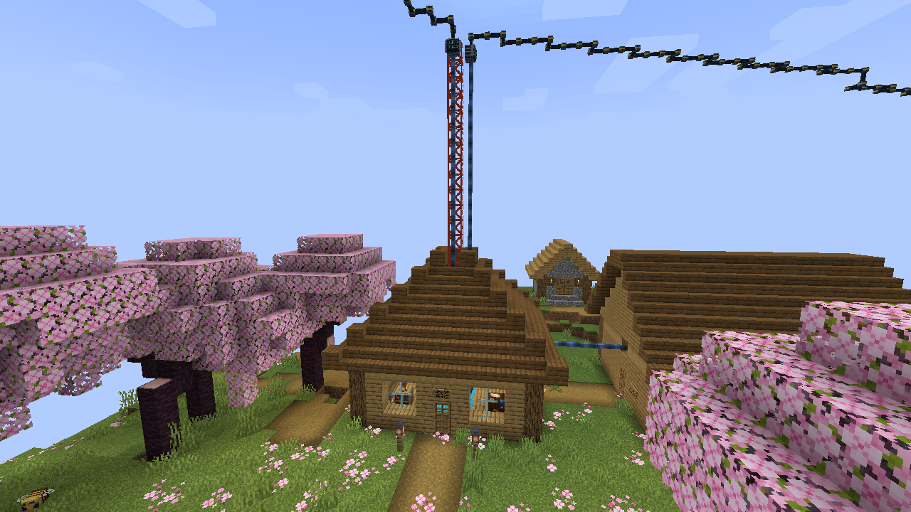

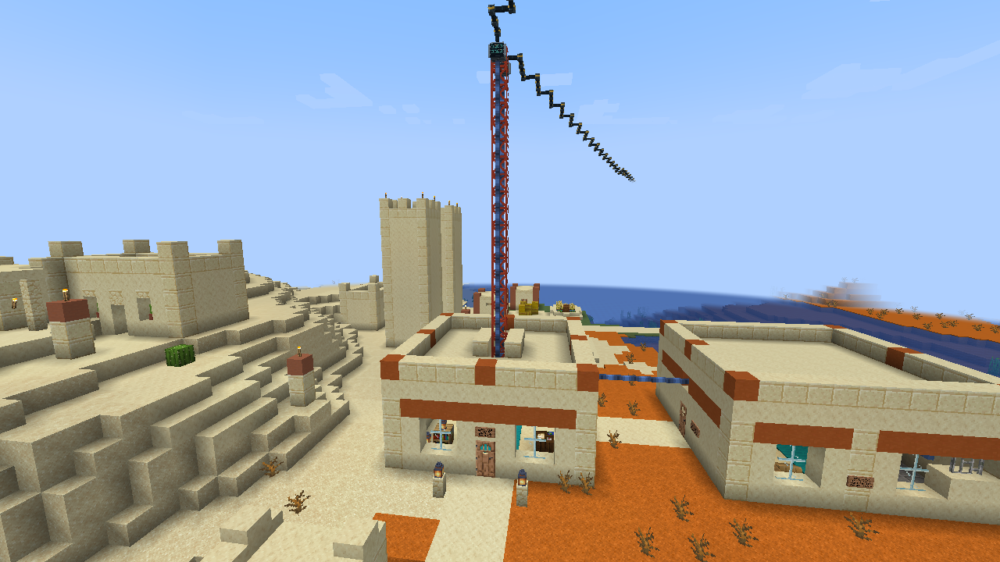

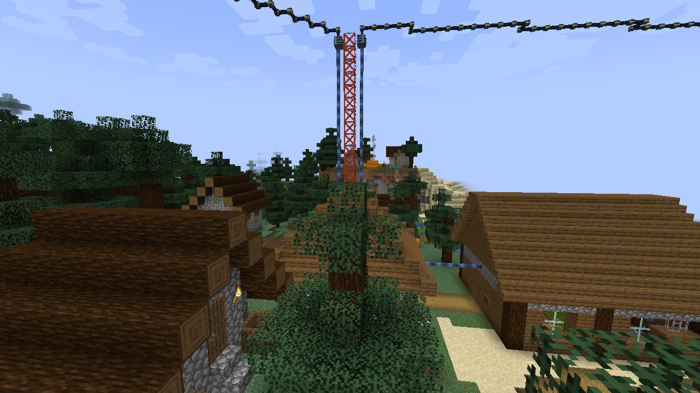

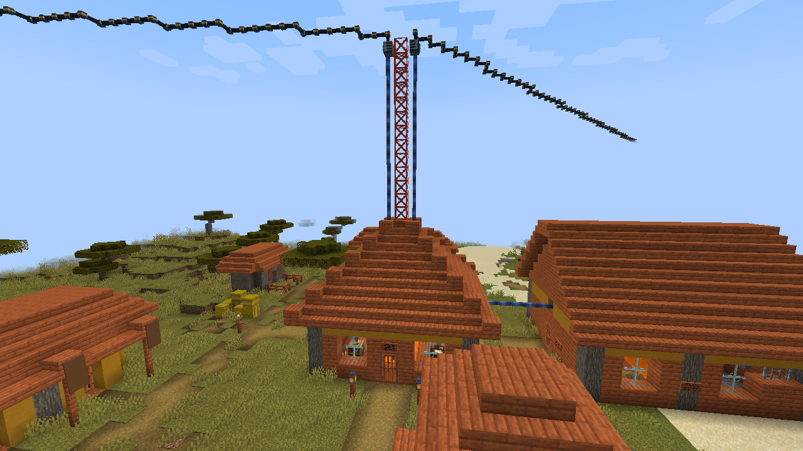

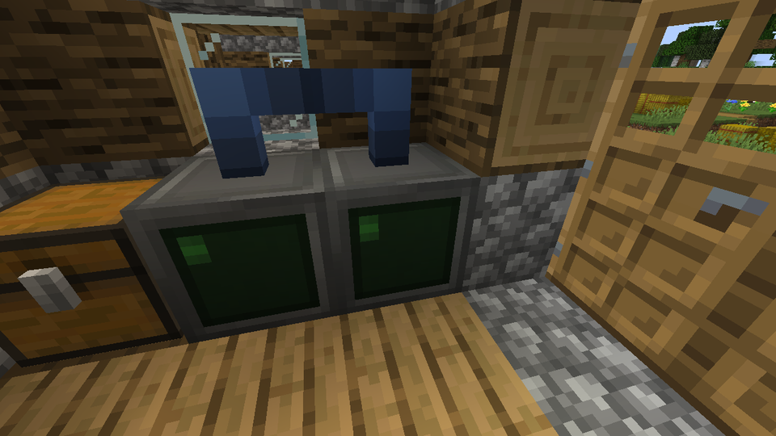

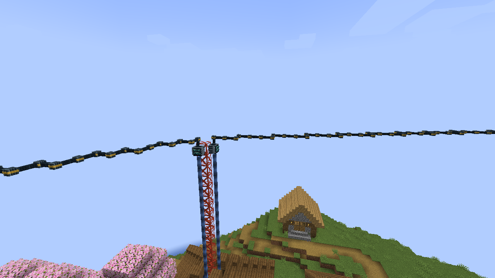

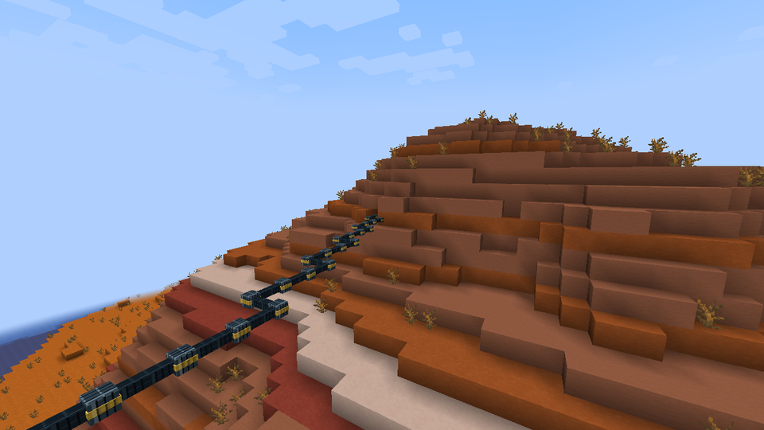

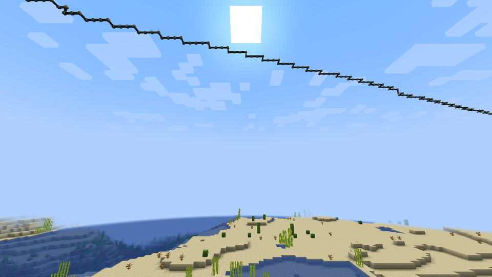

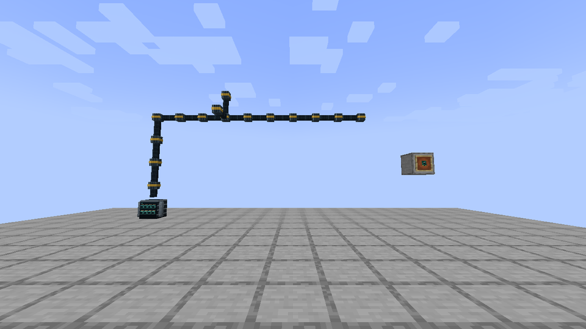

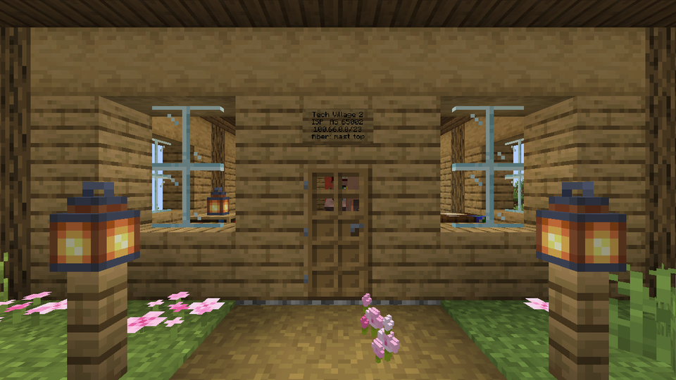

## Two-panel masts, real ISP cabling, Data Centers and chat

Branch `feature/tech-village-v3`, tested on Windows on 2026-10-10. The GameTest world
places its village the way `/place structure` does (structures are off there); every
client-suite run uses natural generation in a fresh world.

| Check | Executed result | Receipt directory |
|---|---|---|
| `ecm-chat` (cargo) | 14 tests: protocol round trips and refusals, room join/broadcast/history/leave, duplicate nicks, guest join, bounded history, full room, client args/config, routes, line editor, display, hints | `chat-rust-20261010-121805` |
| `FiberLineTest` (26.1 JUnit) | 8 tests, adding panel sides, a two-panel ring whose chords never share a block or cross their mast, and the cable router (separation, forbidden cells, portal, unroutable control) | `fiber-line-20261010-111708` |
| `ecm_router` (1.21.1) | 9 GameTests: the earlier six plus ISP cable runs for 240 layouts, two data center servers chatting across villages (refused control), water not washing cables away (open-cell control); the village test now checks both panels, the Data Center, the runs and the in-building cable cut/repair | `tech-router-final-20261010-121140` |
| `ecm_router_scenarios` (1.21.1) | All 13 labs, including the new `router_chat` and the player-built `router_player_fiber` (copper-touching-fiber control) | `tech-router-final-20261010-121140` |
| `ecm_radio` (1.21.1, Aeronautics) | 58 GameTests (shared cable network code) | `radio-shared-cable-20261010-121356` |
| Client suite, normal world seed 73198425 | Villages 2 (plains) and 3 (desert); 4277-block chord; fiber cut 4 -> 12 hops, repair 4; cable up the mast cut 4 -> 12, repair 4; runbook; house PCs of villages 2 and 3 chat via village 4; 17 paired screenshots | `tech-client-final-20261010-121805` |
| Client suite, superflat | Villages 1 and 2 (plains); same checks; 11 paired screenshots | `tech-client-flat-final-20261010-122126` |
| Client suite, normal world seed 123456 | Villages 1 (plains) and 2 (snowy); 3780-block chord; same checks; snowy and savanna buildings photographed. Earlier runs of this seed failed and exposed the water bug (see below) | `tech-client-seed123456-20261010-120830` |

What the new checks prove:

* **Panels and cabling.** Both patch panels sit exactly at the positions planned before
  the village existed, facing their neighbours; the router's eth2 run reaches the
  previous panel and not the next, eth3 the reverse, eth1 the web server's UP face, and
  no run touches another or the buried village cable. The router's own interface
  discovery agrees that those cells are eth1/eth2/eth3. For every style, rotation and
  ordered pair of panel sides (240 layouts) the runs fit and stay apart.
* **In-building cable.** Breaking a block of the cable up the mast takes that fiber link
  down exactly like a fiber cut (no carrier on the router port, the edge reported as a
  cable cut rather than a fiber break); the other end of the router is the control.
  In the natural world the traceroute to the neighbour goes from 4 to 12 hops (the long
  way round) and returns to 4 when the block is put back.
* **Player fiber.** Hand-placed Fiber Span between two patch panels carries pings;
  breaking a span stops them, replacing it restores them, and a copper cable touching
  the fiber (without a panel) is not connected.
* **Data Center and chat.** Every village's web server serves the new page at `/`; two
  data center servers five ASes apart, and in the client suite two house PCs in
  different villages, chat through the chat server over BGP with the server and nick
  from `/etc/chat.conf`; `/who`, `/quit` and the "refused" fix-it hint work.
* **One instance per computer.** A block entity that loads while its headless
  infrastructure computer is booting or running adopts that instance instead of
  starting a second one, and a closing stray instance can no longer unregister the live
  one's NICs (both were possible before).

The ISP pictures earlier in this file were refreshed with these buildings.

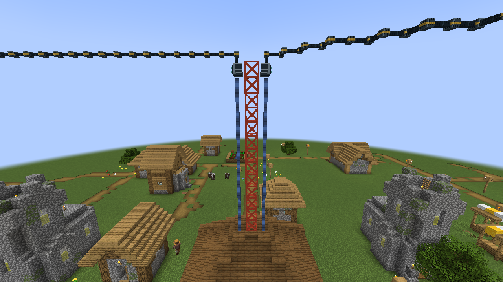

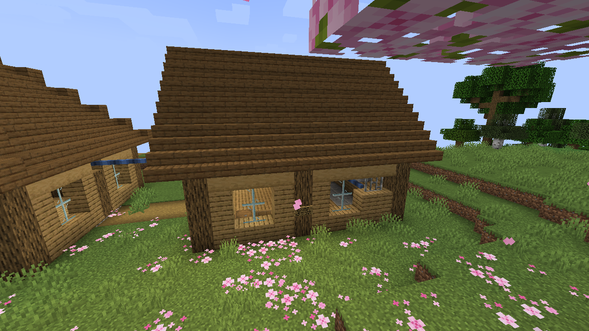

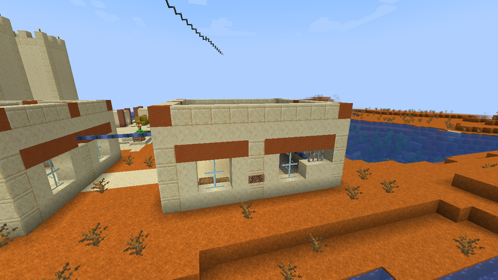

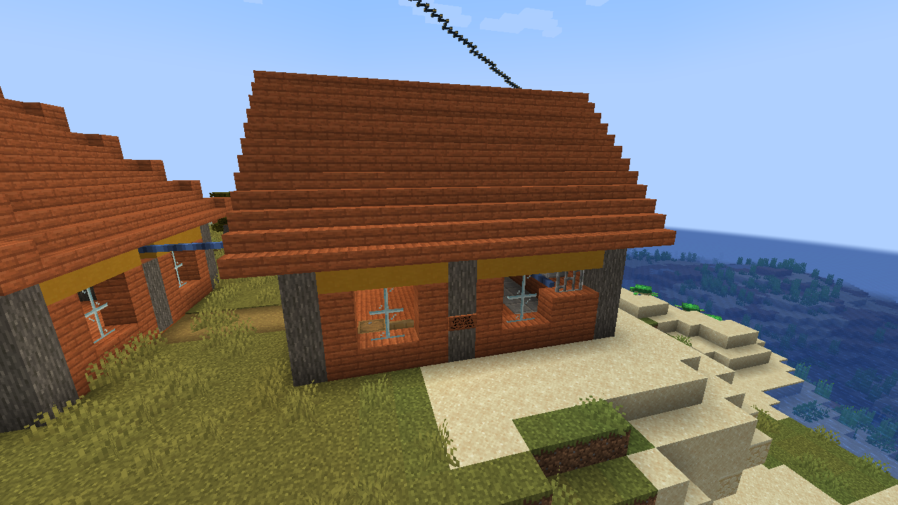

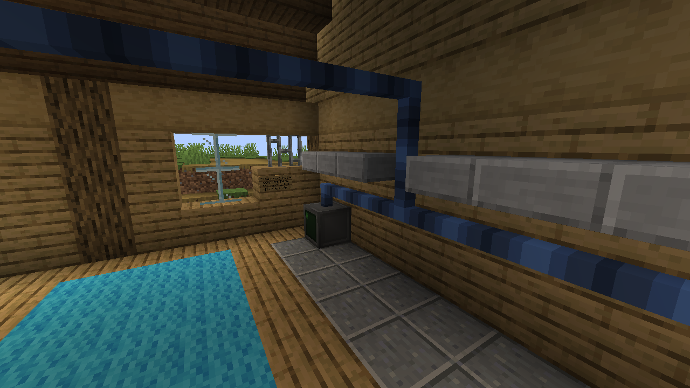

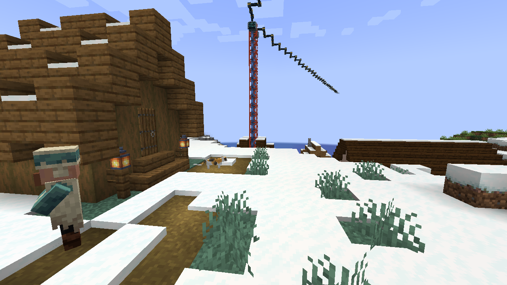

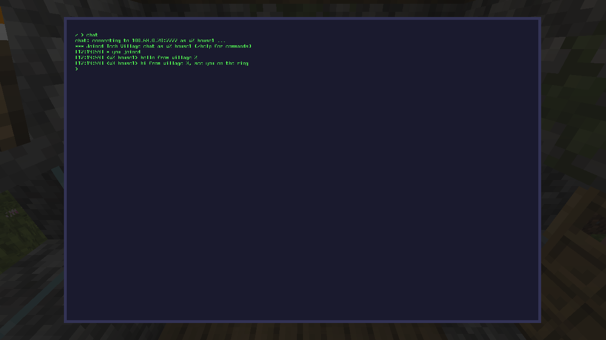

Failures found and fixed on the way (receipts kept): GameTest villages placed into a world
whose fiber already existed snapped terrain-matching streets onto the fiber line and cut
it (`tech-router-20261010-112434`; the GameTest now re-asserts the ring through such a
village); a line typed while a program is still running is lost, so the chat checks
wait for the prompt (`tech-router-20261010-112938`, `tech-client-20261010-113405`); and in
seed 123456 water flowing from a river washed away a snowy village's buried cable within
minutes, taking its houses offline (`tech-client-seed123456-20261010-114718` to `-120049`;
fixed by making cable, Fiber Span and panels solid to fluids).
