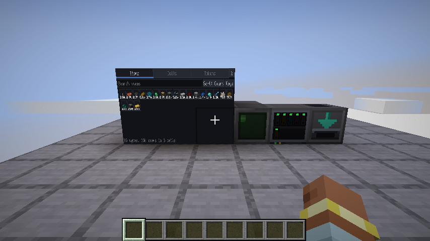
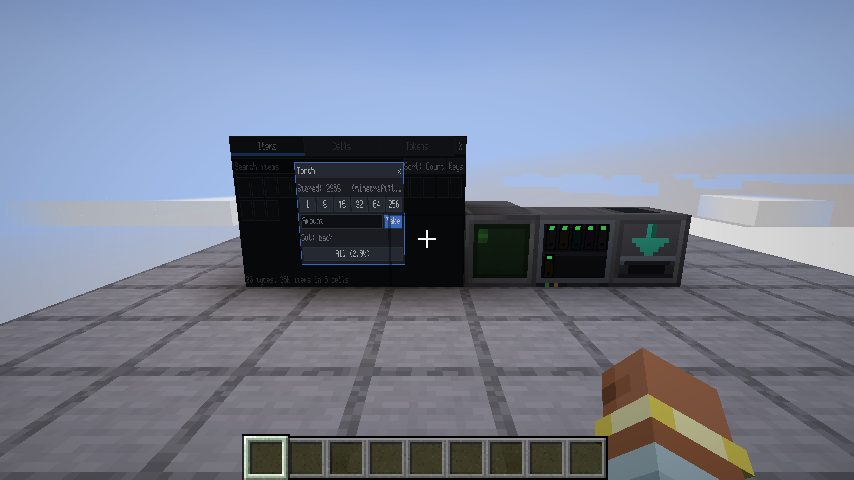
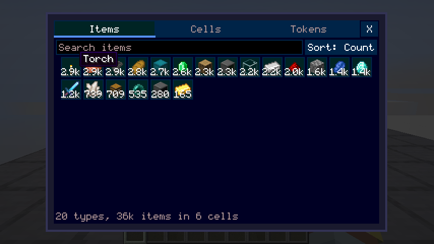

# Item storage

Minecraft 1.21.1. Computers can turn items into ledger entries, move them between Storage Cells, send them to other computers as tokens, and turn them back into items. The built-in `storage` app browses and requests items on the terminal or on an in-world Screen, with every mod's real item icons.

The world's **storage ledger** is the only authority on what exists. Programs only ever see a view of it (item keys, counts, cell ids) or single-use claim tickets (tokens). Copying those bytes anywhere, including to the internet, copies nothing.







*Screenshots from the dev client check (see Testing).*

## Blocks and items

| Thing | What it does |
|---|---|
| **Storage Cell** (1k, 4k, 16k, 64k) | Holds items. The item carries only an id; the contents live in the ledger. |
| **Storage Component** (1k…64k) | Crafting part for cells. Each tier is made from four of the tier below. |
| **Drive** | Ten cell slots (right-click to open, or right-click with a cell). The front shows each cell with an LED: green, amber over 75 %, red when full or refused as a duplicate. |
| **Item Encoder** | Items put in by hoppers, funnels or a right-click are destroyed and credited to a cell it can reach. Nothing is buffered, so a full network pushes back. |
| **Item Decoder** | The only way items leave the ledger. A program asks and the items appear in the inventory in front of it, or in its nine-slot buffer (hoppers and funnels can pull from it). |
| **Storage Module** | A bay module holding one cell, right on the computer. Right-click the bay slot with a cell to insert it; sneak-right-click with an empty hand to take the cell out, then the module. |
| **Wired Bus Module** | The former Wired Sensor Module (same item, and peripheral type `wired_sensors` for existing scripts). Sensor Wire from its connector reaches lidars *and* Drives, Encoders and Decoders (each has a connector on its back). |

## Capacity (AE2's rules)

A cell of *k* kilobytes has `k × 1024` bytes. Each item type costs `bytes / 128` bytes of overhead, every 8 items cost one byte, and a cell holds at most 63 types. Disk space never matters.

| Tier | Bytes | One type, most items |
|---|---|---|
| 1k | 1 024 | 8 128 |
| 4k | 4 096 | 32 512 |
| 16k | 16 384 | 130 048 |
| 64k | 65 536 | 520 192 |

Items that differ in components (damage, enchantments, names, a shulker's contents) are separate types.

## What can reach what

A computer's **storage net** is everything it can reach:

- Drives and Decoders touching it
- Storage Modules in its bays
- Drives, Encoders and Decoders wired to its Wired Bus Module

Any cells and ports in the same net can exchange items: the computer is the router. Access is physical only: whoever reaches a drive can use it.

An Encoder has its own reach, which lets hopper intake keep working with the computer off:

- Drives and computers' Storage Modules touching it
- Those on its own wire

It fills the program's `set_target` cell if one is set. Otherwise it fills AE2-style: first a cell that already holds the item, then any cell with room, higher drive priority first.

## Rules that keep it honest

- **One live copy per cell.** A cell id can be mounted in one place at a time. A copied cell (creative pick, a pick-blocked Drive, a duplication glitch) is refused and shows red. Both copies point at the same contents, so nothing is doubled.
- **No nested filled cells.** Shulker boxes and bundles may be stored, as in AE2 (each full one is a single unique type). A Storage Cell holding items may not be stored anywhere inside another cell: not directly, not in a shulker, bundle or Storage Module, and not in a drive item. That would be unbounded storage. The item tag `evanscomputermod:storage_blacklist` lets pack makers block other items (for example backpacks that hide their contents).
- **Destroyed means gone.** A cell burnt, blown up, cactus'd, despawned, fallen out of the world or `/kill`ed loses its contents. Being picked up by a player, a hopper or a mob does not.
- **Garbage collection.** A cell that no drive or module has mounted for `cellGcDays` in-game days (default 365) is deleted, which covers cells lost to `/clear`. Cells carried by players count as seen when they log in or out.
- **Oversized items.** One item type is capped at `maxTypeBytes` of NBT (default 64 KiB), so a shulker full of books can't bloat the save.

## Tokens

`withdraw_token(cell, key, count, to=None, ttl=None)` debits a cell and returns `"ecmt1_<32 hex>"`: 128 random bits.

- **Single use.** `redeem(token, cell)` deletes the token and credits the cell, in one server-thread call. A second redeem fails. If the target cell has no room the redeem fails and the token stays valid.
- **Addressed tokens.** Pass `to=<cell id>`, and only that cell can redeem the token, so a stolen one is worthless. Unaddressed tokens can be stolen.
- **`split` and `merge`.** Make change; the counts must add up.
- **Expiry.** A token expires after its TTL in game time (default 10 minutes, at most `tokenMaxTtlSeconds`). Its items go back to the origin cell. If that cell is gone or full, they go to the issuing drive's or module's lost & found (`lost()`, `claim_lost()`). Computers attached to the issuer get a `token_expired` event.
- **Caps per issuer.** At most `maxTokensPerIssuer` unspent tokens (64), and `maxItemsInFlightPerIssuer` items (16 384) in tokens plus lost & found. Tokens are for moving items, not for storing them.

## Programs

### Python

```python
import storage

net = storage.net()                          # any storage peripheral works
for it in net.items("iron"):                 # id or name search; '@create' filters one mod
    print(it["name"], it["count"], it["key"])
key = net.find("minecraft:iron_ingot")[0]
net.extract(key, 16)                         # out of the first Item Decoder
cell = net.cells()[0]["id"]
t = net.withdraw_token(cell, key, 32)        # send t to another computer any way you like
net.redeem(t)                                # ...where this lands it in a cell there
storage.wait_changed(timeout=5)              # ('storage_changed', attachment, [cell ids])
```

### Peripheral methods

Types `storage_drive`, `storage_module` and `wired_sensors` all offer these, and each acts on the calling computer's whole net:

| Method | Returns |
|---|---|
| `cells()` | Cell id, short id, tier, device, slot, bytes and types used and total, items |
| `items(query, sort, offset, limit, cell)` | `[{key, id, name, mod, count}]`; `sort` is count, name, id or mod |
| `item_count(query, cell)`, `total(key)`, `find(item_id)`, `item_detail(key)` | |
| `devices()` | Devices, plus ports (encoders and decoders by name) |
| `move(from, to, key, count)` | Items moved |
| `extract(key, count, decoder, cell)` | Items sent out |
| `withdraw_token`, `redeem`, `token_info`, `split`, `merge`, `tokens_issued`, `lost`, `claim_lost` | See Tokens |

Also:

- The Drive adds `info()` and `set_priority(n)`.
- The Storage Module adds `info()`.
- The Wired Bus Module adds `storage_devices()`.
- `item_encoder` has `set_target(cell)`, `set_filter([ids or keys])` and `status()`.
- `item_decoder` has `extract(key, count, cell)`, `buffer()` and `status()`.

Events: `storage_changed(cells)`, `storage_attach(name)` / `storage_detach(name)` (from the wired bus), and `token_expired(token, key, count, "refunded" | "lost")`.

### Rust

`ecm_host_abi::storage::Storage` is a typed client for the same methods (`Storage::find()`, `items`, `cells`, `ports`, `extract`, `tokens_issued`, `lost`, `claim_lost`, plus raw `call`).

## The `storage` app

```text
storage            on the terminal: mouse + keyboard, Esc quits
storage --screen   on the attached Screen cluster: right-click to tap, sneak-right-click for the right button
```

It has three tabs:

- **Items:** a searchable grid. The sort button cycles count, name and mod.
  - Left-click takes one, shift-click or middle-click takes a stack, right-click opens the request dialog.
  - On a Screen, a tap opens the dialog, and the Keys button shows an on-screen keyboard.
  - The dialog has quick amounts, a custom amount, All, and a decoder picker.
- **Cells:** byte and type bars for each cell.
- **Tokens:** unspent tokens, and a Claim button for lost items.

It only uses the public storage API.

## Item overlays (display layer)

A program can't draw item textures: the server has none, and many items aren't a texture at all (3D blocks, tints, glint, custom renderers). Instead it places items over its framebuffer, and the Minecraft client draws them with its own item renderer, so every mod's items look right.

- `ecm_host_abi::gfx_child::items_set(target, &[OverlayItem])` sets the list; host function `gfx_items_set(target, ptr, len)`.
- Each entry has a position, a size, a clip rectangle, flags, an item (a storage key `"k3f"` or an item id `"minecraft:diamond"`) and a label (drawn like a stack count).
- The host resolves items and syncs them with the frame (`ItemOverlayPacket`, sending each item stack to a client once), and clears a program's overlays when it exits.
- **In the terminal GUI:** items are clipped per entry and show full vanilla tooltips on hover.
- **On Screen clusters:** only items drawn whole are shown, within 32 blocks. Looking at one puts its name above the hotbar.
- `ecm-ui` (`rust/crates/ecm-ui`) is the immediate-mode UI library the app uses. It emits these placements for its item cells, and dims or drops the ones a modal covers.

### Mouse changes

- **Screen touch.** Right-clicking a Screen's face sends a press and release at that pixel. The event's source byte is 1 (`mouse::source::SCREEN`).
- **Capture.** Mouse capture now also turns on when only a Screen is attached.
- **Modifier keys.** GUI mouse events carry Shift/Ctrl in byte 9 (`MouseEvent::modifiers`).

## Config (`serverconfig/evanscomputermod-server.toml`, `[storage]`)

`tokenDefaultTtlSeconds`, `tokenMaxTtlSeconds`, `maxTokensPerIssuer`, `maxItemsInFlightPerIssuer`, `cellGcDays`, `maxTypeBytes`.

## Testing

- `scripts\Test.ps1 -Rust ecm-ui,ecm-host-abi,storage -GameTests ecm_storage`: the ledger, cells, tokens, reach, the Python module, item overlays, and the app (mouse click and Screen touch). Add `ecm_sensor` if the wired bus changed.
- Visuals: put a file named `ecm-storage-client-check` in `versions/1.21.1/run`; its text is an output folder. Then run `gradlew :1.21.1:runClient` (with the Sable and Create jars in that folder's `mods/`). The client creates a world, builds the scene, runs the app on a Screen and in the terminal, checks the new models bake, and checks that the Screen shows what the server drew. It saves the three screenshots above and logs `ECM_STORAGE_CLIENT_PASS`.

## Known limits

- **World rollbacks.** Restoring a backup, or a crash between the chunk save and the ledger save, can duplicate or lose the operations since the last save, the same as any block inventory.
- **Wire routing.** Sensor Wire routes along surfaces. Some layouts can't be wired, for example a connector on a face pointing away from the computer; turn the device so its back faces the wire.
