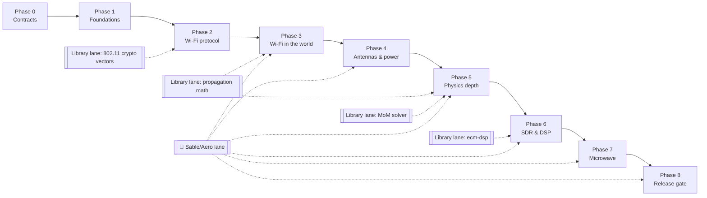

# Radio & Wireless — Implementation Guide

How to build all of [RADIO_WIRELESS_SPEC.md](RADIO_WIRELESS_SPEC.md), phase by phase, with the work split into lanes that parallel agents can own.

- **Target:** Minecraft 1.21.1 (NeoForge). Radio content is registered under `//? if <=1.21.1 {` guards the same way `SensorContent` is. A 26.1 port is out of scope. Pure libraries carry no guards.
- **Base branch:** `staging`. All radio work lands on an integration branch, `feature/radio`, which merges into `staging` once per phase gate.
- **Models:** every new block and item model is built with the **Blockbench MCP server** (see [Models: Blockbench MCP](#models-blockbench-mcp)).

Legend used throughout:

| Mark | Meaning |
| --- | --- |
| ⚡ | Lane can run **in parallel** with the other ⚡ lanes in the same phase, each owned by its own agent |
| 🔒 | **Serial**: one agent; other lanes wait for it or build against its frozen contract |
| 🚢 | Sable / Create Aeronautics work (required on 1.21.1) |
| 🎨 | Needs Blockbench models |

---

## 1. What exists on `staging` today

Build on these; don't reinvent them. `J/` = `src/main/java/com/example/evanscomputermod/`.

| Area | Existing code | Used for |
| --- | --- | --- |
| L2 fabric | `J/computer/NetworkHub` (per-segment flood, `NicMailbox` rx queues, TAP and InternetProxy egress), `J/computer/CableNetworkManager` (BFS segments, atomic snapshot publish, `logicalLink`), `J/block/NetworkCableBlock` | `transmitFromPort`, forwarding table, `RadioMedium` beside it |
| Kernel network | `rust/operating-system/rust/src/net/mod.rs` (`Nics` trait, `eth{i}`), `net/ipc.rs` (socket syscalls 0–14, no `AF_PACKET`), `net/netlink.rs` | `wlan0`, packet sockets, `radio0` |
| Stack | `rust/crates/ecm-net` (arp/eth/ipv4/icmp/udp/tcp/dns/http; **no DHCP**) | `dhclient`/`dhcpd` |
| ABI | `abi/host-abi.toml` + `scripts/check-abi.py` + `ComputerInstance.checkKernelImports` + simulator strict linking; child functions in `J/computer/wasi/WasiFunctions` mirrored in `rust/simulator/src/child.rs` | `wifi_*` host calls |
| Device files | `J/computer/wasi/DeviceFd`, `J/speaker/AudioDeviceFd` (`/dev/audio.<name>`, `/dev/audioctl.<name>`) | `/dev/sdr0` |
| Audio to players | `J/speaker/SpeakerAudio`, `ImaAdpcm`, `SpeakerAudioPacket`; `rust/crates/ecm-audio`; `aplay`, `player` programs | Handheld receiver audio, `rx_fm`/`rx_am` |
| Peripherals | `J/api/IPeripheral`, `IComputerModule(Item)`, `AnnotatedPeripheral`/`@PeripheralMethod`, `J/computer/peripheral/PeripheralHub` (`setModule`, `setWireless`), `J/module/ModuleBays` (4 bays), `PeripheralValues` ↔ `ecm-host-abi/src/peripheral.rs` | Wi‑Fi module, Controller Receiver, SDR, dish |
| Controller | `J/controller/*` (`ControllerServer.handleInput` range check, `WirelessControllerHub` via `setWireless`) | 2.4 GHz migration |
| Config | `J/EcmConfig` (COMMON spec, static getters with defaults) | New SERVER `RadioConfig` |
| Ray budget | `J/sensor/LidarScanner.claim(server, want)` (4096 rays/tick), incremental `Job` | Link-cache recompute budget |
| Fine wire | `J/sensor/wire/*` (PowerGrid port: `BlockWireEntity`, `WireConnections`, `WireSableMover`), item `sensor_wire` | Fine Wire rename, VHF/UHF antennas |
| Sable | `J/sable/SableCompat`, `SableAssemblyHooks` (state across moves), `J/sensor/SensorSable` (`frame`, `toWorld`, `sameSubLevel`), `J/sensor/mixin/SableAssemblyMixin` | Every 🚢 item |
| Create | `J/compat/create/*` (Redstone Link module and peripheral) | Player-built airship receivers |
| Feature registration | `J/sensor/SensorContent.register(modBus)` (own `DeferredRegister`s, creative-tab event, payloads, `PeripheralTypes.register`) | Template for `RadioContent` |
| Tests | `scripts/Test.ps1`, GameTests in `J/testing/v1211/*`, scenarios in `J/testing/scenario/*` + `J/command/ScenarioCommand`, `KernelHostIntegrationTest`, the bridge netsim (`rust/crates/ecm-bridge/tests/common`), `rust/simulator` (wasmtime host, TOML scenarios, virtual clock) | All gates |
| Runtimes | Chicory (default, pure Java), wasmtime sidecar, simulator | Every new host function must work on all three |

**Dependencies outside staging:** PR #48 (`feature/tech-village-router`) carries `AGENTS.md`, the Blockbench pipeline (`models/*.bbmodel`, `models/README.md`, `scripts/gen-tech-assets.py`, `Test.ps1 -ClientChecks`) and `rust/crates/ecm-router` (including a DHCP server in `dhcp.rs`). Merge #48 into `staging` before Phase 0. Otherwise Phase 0 has to port those pieces.

---

## 2. Rules every agent follows

1. **Testing:** follow `TESTING.md`, `AGENTS.md` and `ModTesting.md`.
   - Implement a coherent chunk before testing it.
   - Run only targeted tests, each at most 1 minute of game time.
   - Keep failure receipts and report the counts that actually ran.
   - Compiling is not passing.
2. **1.21.1 only:** build and test 1.21.1 only (`Test.ps1` default). Finish every change by building the 1.21.1 jar into the repo root.
3. **Scenarios:** every gameplay feature ships `/ecm scenario spawn` scenarios (auto / manual / fast) that GameTests reuse. A feature without a run scenario is unfinished.
4. **Render checks:** client-visible blocks need a real render check: a screenshot plus paired server/client assertions, from an isolated scripted client.
5. **Physics:** no arbitrary range numbers. Every range comes from the link budget (spec design principle 1).
6. **Pure libraries stay pure:** no Minecraft imports in `J/radio/phys`, `J/radio/wifi80211`, `J/radio/antenna`, or in `ecm-wifi`/`ecm-dsp`. They are unit-tested against published reference numbers first.
7. **Host-function parity:** every new host function lands in Chicory, the wasmtime sidecar and the simulator in the same change, with `check-abi.py` passing.
8. **Stable IDs:** registry IDs are frozen in Phase 0 and never renamed later.

---

## 3. How parallel agents work together

- **Worktrees:** one agent per lane, each in its own worktree. Reuse idle worktrees in `D:\MinecraftMods\ECM-wt\` (`bridge`, `net`, `sim`, `ssh`, `integ`) before creating new ones; check `git status` and the last commit date first. Lane branches are named `radio/p<phase>-<lane>`, cut from `feature/radio`.
- **Integration agent (🔒):** one per phase.
  - Owns `feature/radio` and merges lane branches.
  - Is the only agent that edits the shared files below.
  - Runs the phase gate.
- **Shared files:** lanes don't edit these. They hand the integration agent a short snippet instead.

| Shared file | Why it conflicts |
| --- | --- |
| `J/EvansComputerMod.java` | Every feature registers here |
| `J/network/ModNetwork.java` | Payload registration |
| `abi/host-abi.toml`, `J/computer/ComputerInstance.java` (host fn table), `rust/simulator/src/child.rs` | ABI must match in three places |
| `J/command/ScenarioCommand.java` catalog | One merged map |
| `assets/evanscomputermod/lang/en_us.json` | One JSON file |
| `rust/Cargo.toml` workspace members, `src/main/resources/wasm-bin/manifest.txt` | Every new crate or program |
| `J/block/NetworkCableBlock.java`, `J/computer/NetworkHub.java` | Owned by one lane per phase (named in that phase) |

- **Avoiding collisions:**
  - Each lane registers through its own `*Content.register(modBus)` class (the `SensorContent` pattern), so lanes rarely collide.
  - Lanes code against interfaces frozen in Phase 0, never against another lane's unfinished classes.
- **Gate rule:** a phase is done only when its gate passes on `feature/radio`. Lanes in the next phase may start against frozen contracts before then, but they don't merge until the gate is green.
- **Library lanes start early:** pure libraries (propagation math, MoM solver, `ecm-dsp`, 802.11 crypto) have no Minecraft dependencies. They can start in Phase 1 alongside everything else; their *integration* follows the phase order. This is the biggest source of parallelism in the plan.

Library lanes (dashed) run from Phase 1 onward and feed the phase that integrates them. The 🚢 lane delivers a ship requirement inside every phase from 3 on.

---

## 4. Phases

Each phase lists its lanes, what they deliver, where the code goes, and the gate. The phases are the spec roadmap's seven, plus Phase 0 for contracts and Phase 8 for the release gate.

### Phase 0 — Contracts and scaffolding 🔒

One agent, short, and it unblocks everything else. Output: interfaces and stubs that compile, with no behaviour yet.

- **Package layout:**
  - `J/radio/` with `RadioContent.register(modBus)` (1.21.1 guard).
  - Sub-packages: `medium/`, `phys/` (pure), `antenna/` (pure solver + MC graph extraction), `wifi80211/` (pure), `wifi/` (AP, module), `sdr/`, `power/`, `hazard/`, `microwave/`, `handheld/`, `compat/sable/`, `compat/aero/`.
- **Frozen interfaces:**
  - `RadioEndpoint`: world pose, band, antenna ref, tx power, sensitivity.
  - `Emission`: band, centre frequency, bandwidth, start/end on the airtime clock, payload kind (frame / IQ / energy).
  - `RadioMedium`: `transmit`, `subscribe`, `airtimeNow`.
  - `LinkBudget` record and `AntennaPattern` (gain table + polarization, local frame).
  - `Band` / `Channel` enums, including the spectral masks.
- **Energy:** `J/energy/` with a base `RadioEnergyStorage` over NeoForge FE capabilities, plus the conversion constant (1 FE/t = 5 W).
- **Config:** new SERVER config `RadioConfig`, synced, holding every key the spec names: realism preset, distance compression, amp tiers, sample-rate caps, `power.burnerGenerator.enabled`, `power.wattsPerFePerTick`, hazard defaults, Sable re-check thresholds.
- **Registry ID list:** every block, item, block entity, menu, data component and tag from the spec, written once into `RadioIds` and the lang file.
- **ABI draft in `abi/host-abi.toml`:**
  - kernel imports `wifi_tx_frame`, `wifi_rx_frame`, `wifi_set_channel`, `wifi_set_rx_filter`;
  - `AF_PACKET` syscall ids in `SocketFd` / `net/ipc.rs`;
  - the `/dev/sdr<N>` and `/dev/sdrctl<N>` device-file contract (modelled on `AudioDeviceFd`).
  - All of these are stubbed in Chicory, the wasmtime sidecar and the simulator so `check-abi.py` passes.
- **Data schemas:**
  - data maps `evanscomputermod:rf_attenuation` and `rf_conductor`, and wire/coax tier maps;
  - tags `rf_conductors`, `rf_insulators`, `rf_good_ground`;
  - an empty `RadioScenarios.ALL`, plus a GameTest holder `RadioTests` (namespace `ecm_radio`) with its structure from `scripts/gen-gametest-structure.py`.
- **Shared test vectors:** IEEE 802.11 Annex J vectors in `docs/radio/vectors/`, read by both JUnit and `cargo test`.

**Gate:** 1.21.1 jar builds, `check-abi.py` passes, `/ecm scenario list` shows the radio catalog (empty), and the control GameTest passes.

### Phase 1 — Foundations

| Lane | Work | Code |
| --- | --- | --- |
| ⚡ 1A Packet sockets | `AF_PACKET` bound to interface + EtherType; send/recv whole frames; netlink lists it | `net/ipc.rs`, new `net/packet.rs`, `J/computer/wasi/SocketFd`, `ecm-host-abi/src/socket.rs` |
| ⚡ 1B DHCP programs | `dhcpd` (pools, leases persisted to the computer FS, reservations, options, NAK/RELEASE/DECLINE) and `dhclient` (full state machine, `ifconfig <iface> dhcp`, applies DNS via `resolvectl`). Build against 1A's frozen API; reuse `ecm-router/src/dhcp.rs` from #48 for message codecs | `rust/wasm-programs/dhcpd`, `dhclient`; DHCP codec in `ecm-net/src/dhcp.rs` |
| ⚡ 1C NetworkHub bridging | `transmitFromPort(portId, frame)`, bridge-port registration, MAC-learning forwarding table per segment (invalidated on `recomputeNetworks`), unicast to bridged MACs never leaks to TAP | `J/computer/NetworkHub` (**owner of NetworkHub this phase**), `CableNetworkManager` |
| ⚡ 1D Energy + Burner Generator 🎨 | FE storage base; Burner Generator (furnace-fuel data map, 20–40 FE/t); `ICondition` recipe condition on config; `c:hidden_from_recipe_viewers`; "disabled by server config" state | `J/energy/`, `J/radio/power/BurnerGenerator*` |
| ⚡ L1 Propagation library | Friis, two-ray with ground permittivity, knife-edge + Deygout (ITU-R P.526), Fresnel radius, α(f) material scaling, SINR → BER → PER per modulation, Rician/Rayleigh fading with seeded RNG. JUnit vs. ITU worked examples | `J/radio/phys/` (pure) |
| ⚡ L2 MoM solver library | Thin-wire Method of Moments: segment input, image ground, complex N×N solve, sweep, outputs (Z, SWR, η, 5° pattern, polarization, peak current/voltage). JUnit: dipole ≈ 73 Ω / 2.15 dBi, monopole ≈ 36 Ω, Yagi vs. NEC | `J/radio/antenna/solver/` (pure) |
| ⚡ L3 `ecm-dsp` crate | Complex types, FFT, windows, FIR/IIR, resampling, NCO, AGC, PLL, Costas, timing recovery; modems AM/FM/SSB/CW/FSK/AFSK/PSK/chirp; CRC, Hamming, Viterbi, Reed–Solomon, HDLC/AX.25/KISS. `cargo test` modem round trips at stated BER | `rust/crates/ecm-dsp` |
| ⚡ L4 802.11 crypto | PBKDF2, PRF-384, CCMP, AES key wrap, MIC in **both** Java and Rust against `docs/radio/vectors/` | `J/radio/wifi80211/crypto`, `rust/crates/ecm-wifi/src/crypto` |

The library lanes (L1–L4) keep running into later phases. 1A must freeze its API on day one so 1B can start right away.

**Gate:** a computer runs `dhcpd` on `eth0` and another gets a lease with `dhclient` over cable. Controls: no server means no lease, and a NAK path is shown. Bridge FDB JUnit passes. Burner Generator scenario passes.

### Phase 2 — Wi‑Fi protocol

| Lane | Work | Code |
| --- | --- | --- |
| ⚡ 2A Java 802.11 package | Frames, IEs (SSID, RSN), beacons, probe, auth, assoc, EAPOL 4-way (AP side), CCMP data, PN replay, LLC/SNAP, deauth/disassoc, GTK rekey, retry/timeouts. Uses L4 crypto | `J/radio/wifi80211/` (pure) |
| ⚡ 2B `ecm-wifi` crate | mac80211-style client: scan/auth/assoc state machine, CCMP, minstrel-style rate control, presents `wlan0` to `ecm-net` as an Ethernet interface (new `Nics` implementation) | `rust/crates/ecm-wifi`, `operating-system/rust/src/net/wifi.rs` |
| ⚡ 2C Userspace programs | `wpa_supplicant` (EAPOL over 1A packet sockets, PMK/PTK, installs keys, network selection, roaming), `iw` (`scan`, `link`, `set type monitor`), `wpa_cli` | `rust/wasm-programs/wpa_supplicant`, `iw`, `wpa_cli` |
| 🔒 2D Interop harness | Ideal in-memory medium (no world): Java AP state machine ↔ real kernel + `wpa_supplicant` through `KernelHostIntegrationTest`-style host; golden pcaps parsed byte for byte on both sides | `src/test/.../radio/WifiInteropTest`, fixtures in `src/test/resources/radio/pcap/` |

2A, 2B and 2C run in parallel against the Annex J vectors and a frozen frame-format doc. 2D starts once 2A and 2B can exchange frames.

**Gate:** associate, run the 4-way handshake, get DHCP across the bridge, and ping, all in the interop harness. Negative cases: wrong password fails at the M2 MIC, a replayed PN is dropped, a lost M3 is retransmitted, deauth is handled.

### Phase 3 — Wi‑Fi in the world

| Lane | Work | Code |
| --- | --- | --- |
| ⚡ 3A RadioMedium core | Sharded per band/channel; world airtime clock; interference sums with ACI masks; per-frame PER roll; immutable link-cache snapshot; per-band spatial index + culling; recompute on endpoint move / antenna change / section version; ray budget via generalised `LidarScanner.claim`; chunk RF summary on unload; voxel obstruction with `rf_attenuation` (uses L1). No per-frame allocation | `J/radio/medium/` |
| ⚡ 3B Access Point block 🎨 | Block + BE on a cable; L2 bridge using 1C `transmitFromPort`; GUI (SSID, hidden, security, passphrase, channel, power, isolation, MAC filter); status page; passphrase server-only (never in sync packet); owner/claim check; sneak + wrench reset; **no special Internet Gateway handling** | `J/radio/wifi/ap/` |
| ⚡ 3C Wi‑Fi module 🎨 | Bay module item + `IComputerModule`; SoftMAC low MAC (ACK, retry, CSMA/CA, FCS, airtime, RX filter, monitor + radiotap); kernel host functions `wifi_*` on all three runtimes; **controller mode** | `J/radio/wifi/module/`, ABI files (via integration agent) |
| ⚡ 3D Controller migration 🎨 | Remove `EcmConfig.controllerRange()` and the distance check in `ControllerServer.handleInput`; controller emits ~0 dBm 2.4 GHz report frames through `RadioMedium`; dedicated **Controller Receiver** bay module plus the 3C controller mode, either attaching through `PeripheralHub.setWireless`; hold-then-neutral on loss; HUD shows signal / "No signal"; pairing without a receiver says one is needed | `J/controller/*`, `J/radio/wifi/receiver/` |
| ⚡ 3E 🚢 Sable endpoint layer | World pose and orientation for every endpoint via `SensorSable.frame`/`toWorld`; sub-level-aware voxel trace (blocks of crossed sub-levels in their local space); motion-threshold invalidation with per-sub-level rate limit and interpolation; velocity → coherence time; state across assembly via `SableAssemblyHooks`; Wi‑Fi re-association after reassembly | `J/radio/compat/sable/` |
| ⚡ 3F Scenarios + bench | `wifi_room` (auto/manual/fast), `wifi_ship` (AP and module on a moving sub-level); GameTests reuse them; JMH-style medium benchmark harness at 100 / 1,000 / 10,000 radios | `J/testing/scenario/RadioScenarios`, `J/testing/v1211/RadioTests`, `src/test/.../radio/MediumBench` |

3A owns `J/radio/medium/`. 3B, 3C and 3D call it only through the Phase 0 `RadioMedium` interface, so all six lanes run at once.

**Gate:** `wifi_room` passes: `iw dev wlan0 link` shows RSSI and bitrate dropping with distance and walls, and 1/6/11 channels coexist. `wifi_ship` passes. The controller's range follows walls and a busy channel. Controls: no receiver module means no input; an iron room blocks the link.

### Phase 4 — Antennas and power

| Lane | Work | Code |
| --- | --- | --- |
| 🔒→⚡ 4A ConductorBlock 🎨 | Shared `ConductorBlock` base (6-side auto-connect, waterloggable, wrench cut/restore); tiers copper wire, antenna wire, heavy cable, rod/tube, lattice mast (climbable); materials copper/iron/gold with oxidation + wax; **move `NetworkCableBlock` onto it** (owner of `NetworkCableBlock` this phase). Freeze the base class first (🔒, about a day), then the tiers run in parallel | `J/radio/conductor/`, `J/block/NetworkCableBlock` |
| ⚡ 4B Support blocks 🎨 | Insulator (voltage rating), feed point (coax port), coax + hardline (connect only to RF parts; loss per tier/frequency), lightning arrestor | `J/radio/conductor/support/` |
| ⚡ 4C Fine Wire | Rename display name to **Fine Wire**, keep `sensor_wire` ID (or add an alias); extract fine-wire runs as antenna segments split at λ/10; ≤ 5 W feed | `J/sensor/wire/*`, `J/radio/antenna/graph/` |
| ⚡ 4D Amplifiers + tuner 🎨 | 100 W / 1 kW / 10 kW amps, FE draw only while transmitting (airtime from 3A), brownout, SWR foldback on higher tiers; tuner moves the mismatch loss into itself | `J/radio/power/` |
| ⚡ 4E Antenna graph + tools 🎨 | Conductor-graph extraction from a feed point (block wires 1 m, fine wire λ/10, touching conductive blocks, ground under each segment); heuristic classifier (dipole/monopole/loop/long wire); analyzer item + `antenna` program + Jade provider (new optional Jade dep) | `J/radio/antenna/graph/`, `J/radio/tools/` |
| ⚡ 4F 🚢 Ships | Conductor graphs and coax survive assemble/disassemble; graphs never connect across a sub-level boundary; `NetworkCableBlock` segments keep membership across moves | `J/radio/compat/sable/` |
| ⚡ 4G 🎨 Modelling | One agent builds every Phase 4 model in Blockbench (see the model list) while 4A–4E write logic against placeholder model IDs | `models/`, `assets/` |

**Gate:** the analyzer reports SWR for a built HF dipole, and the Jade tooltip names the weakest link. Wires survive ship assembly. Cable networks are unchanged after the `NetworkCableBlock` refactor (re-run the switch and router GameTests).

### Phase 5 — Physics depth

| Lane | Work | Code |
| --- | --- | --- |
| ⚡ 5A Solver integration | Wire L2 into the antenna cache: worker-thread solve on graph change, sweep per serviceable band, heuristic fallback while pending or above the segment cap | `J/radio/antenna/` |
| ⚡ 5B Path physics | Heightmap (MOTION_BLOCKING) middle path + 32-block voxel ends; diffraction (≤ 3 edges); two-ray ground; polarization loss; ionosphere (D-layer by day, F-layer skywave with skip zone and MUF at night, none in Nether/End); VLF/LF ground and water penetration; noise (atmospheric, lightning, rain fade > 10 GHz) | `J/radio/medium/path/` using L1 |
| ⚡ 5C Thermal model + hazards | Per-part temperature integration; melt, arc and corona thresholds with warning stages; RF exposure; lightning via vanilla rod targeting + arrestor; gamerules (`off`/`equipment`/`full`, lightning toggle, `doFireTick`); world edits through `BlockEvent`s with a fake player owned by the placer; `AntennaOverloadEvent`, `RadioTransmitEvent`, `HazardEvent` | `J/radio/hazard/` |
| ⚡ 5D 🚢 Ships | Gain patterns and polarization rotate with sub-level orientation; ship hull obstruction both ways; ground = first sub-level block below (metal hull counterpoise) or none at altitude | `J/radio/compat/sable/` |

**Gate:** solver matches the NEC references. The thermal time-to-failure is exact and reproducible. Rotating a ship 90° changes level by the computed pattern and polarization loss. A hull between two ground stations attenuates their link.

### Phase 6 — SDR and DSP

| Lane | Work | Code |
| --- | --- | --- |
| ⚡ 6A SDR block 🎨 | Three tiers (Basic / Standard / Advanced; rates 48 k / 250 k / 1 MS/s, Advanced capped to 250 kS/s on Chicory); peripheral methods + events; `/dev/sdr<N>` and `/dev/sdrctl<N>` device files modelled on `AudioDeviceFd` (`cs16`/`cf32`); tx through amp → coax → antenna with claim checks | `J/radio/sdr/` |
| ⚡ 6B IQ synthesis | Per-receiver sum over in-band emitters on a world sample clock (gain, fading phasor, delay, frequency shift, noise); packet emitters as band-limited noise bursts; SDR tx counts as interference to packet radios; skip emitters 10 dB under the noise floor; overflow/underflow events | `J/radio/medium/iq/` |
| ⚡ 6C `radio` Python + programs | `_radio` native module + `radio.py` (flowgraphs) following the `_peripheral` + `peripheral.py` pattern; programs `rx_fm`, `rx_am`, `rx_ssb`, `waterfall`, `scan`, `tx_tone`, `afsk1200`, `radio_station`, `iqrec`/`iqplay` (SigMF) using L3 `ecm-dsp` | `rust/wasm-programs/python/src/`, `rust/wasm-programs/<name>` |
| ⚡ 6D Handheld receiver 🎨 | Receive-only item, AM / HF / VHF FM bands, whip model, dial/band/meter/scan/volume/squelch UI; server-side link budget + demod at the player; audio via the `SpeakerAudio` + `ImaAdpcm` packet path, noise matched to SNR; synthesized only while held and on | `J/radio/handheld/` |
| ⚡ 6E `radio0` interface | KISS-TNC bridge: a packet modem becomes an IP interface in `ecm-net` so `ping`/`ssh` run over VHF packet | `operating-system/rust/src/net/radio0.rs` |
| ⚡ 6F 🚢 Ships | SDR and handheld on an airship hear ground stations; Doppler stays ignored, delay applied | `J/radio/compat/sable/` |

**Gate:** `sdr_lab` passes: `radio_station` broadcasts FM, a handheld hears it with noise that grows with distance, and `afsk1200` + `radio0` carry a ping. The airship variant passes.

### Phase 7 — Microwave links

| Lane | Work | Code |
| --- | --- | --- |
| ⚡ 7A Dish multiblock 🎨 | 1×1 / 2×2 / 3×3 dishes; gain η(πD/λ)², beamwidth; yaw/pitch aiming via GUI and peripheral | `J/radio/microwave/dish/` |
| ⚡ 7B Microwave radio 🎨 | Block on a cable + coax to a dish; L2 bridge reusing the 3B AP bridging and 1C `transmitFromPort`; Gbps-class rates | `J/radio/microwave/` |
| ⚡ 7C Bands | 10 / 24 / 60 GHz channel plans, rain fade, 60 GHz oxygen absorption (extends 5B) | `J/radio/medium/path/` |
| ⚡ 7D 🚢 Ships | Alignment follows sub-level orientation; the link drops on a moving ship unless a computer re-aims | `J/radio/compat/sable/` |

**Gate:** a dish link scenario joins two LANs. A misaimed dish loses the link. Rain fade shows at 24 GHz. A re-aiming program holds a link from a moving ship.

### Phase 8 — Aeronautics, modpack polish, release gate

| Lane | Work | Code |
| --- | --- | --- |
| ⚡ 8A 🚢 Aeronautics data | `rf_attenuation` and conductor tags for `aeronautics` and `simulated` blocks (envelopes transparent, metal frames reflect / counterpoise) as optional data with `neoforge:mod_loaded` conditions; above-heightmap path rules; `compileOnly` Aeronautics jars + staging in `Test.ps1` and `fetch-libs.sh` (sources in `D:\MinecraftMods\CreateAddonReferences\Simulated-Project`) | `J/radio/compat/aero/`, `resources-mc1.21.1/data/` |
| ⚡ 8B Release scenarios | `airship_radio` (ping holds, RSSI falls, link reassociates), assemble → fly → disassemble → reload, hull attenuation, ship rotation | `RadioScenarios`, `RadioTests` |
| ⚡ 8C Scale | Benchmarks at 100 / 1,000 / 10,000 radios; scaling with worker threads; no raycasts or per-frame allocation on the hot path; tracked over time | `MediumBench` |
| ⚡ 8D Modpack compatibility | Capabilities (antenna, amplifier, radio), JEI/EMI info pages, KubeJS `NativeEvents` examples, realism presets, docs/help pages | various |

**Release gate:** every item in the spec's release-gate box passes in the real game on 1.21.1, with Sable, Create, Simulated and Aeronautics installed. Receipts are attached to the PR.

---

## 5. Peak parallelism at a glance

| Phase | Parallel lanes (⚡) | Serial pieces (🔒) | Suggested agent count |
| --- | --- | --- | --- |
| 0 | — | Contracts and scaffolding | 1 |
| 1 | 1A, 1B, 1C, 1D, L1, L2, L3, L4 | 1A API freeze (day one) | 8 + integration |
| 2 | 2A, 2B, 2C (+ L1–L3 continuing) | 2D interop harness | 3–6 + integration |
| 3 | 3A–3F | — | 6 + integration |
| 4 | 4B–4G, 4A tiers | 4A base class freeze | 6–7 + integration |
| 5 | 5A–5D | — | 4 + integration |
| 6 | 6A–6F | — | 6 + integration |
| 7 | 7A–7D | — | 4 + integration |
| 8 | 8A–8D | Release gate run | 4 + integration |

Idle worktrees cap how many agents can run at once. When there are fewer worktrees than lanes, give priority to lanes on the critical path: 1A → 2B/2C → 3A/3C → 4A → 5A → 6A/6B.

---

## 6. Models: Blockbench MCP

All new block and item models are made through the **Blockbench MCP server**, following `AGENTS.md`'s model rule and the pipeline in `models/README.md` (from #48).

**Setup and check (every modelling session)**
1. Open Blockbench (desktop, with the MCP plugin) **before** starting the Claude session; the server listens on `http://localhost:3000/bb-mcp`. If the session started first, reconnect **blockbench** with `/mcp`.
2. Verify with `get_capabilities`: expect the `java_block` format listed. Most modelling tools (`place_cube`, `create_texture`, `apply_texture`, `set_display_transform`, `export_model`) enable only once a project is open.

**Workflow per model**
1. `create_project` in **Java Block/Item** format.
2. Build with cubes and paint the textures in Blockbench. Use cube-name prefixes when the model is multipart (`center`, `north` … `up` for 6-side connectors), as `gen-tech-assets.py` expects.
3. Save the editable project as `models/<id>.bbmodel` with its texture embedded, plus a native `models/<id>-preview.png`.
4. Export game assets with `py -3 scripts/gen-tech-assets.py`. Don't rely on `export_model` alone: it is marked experimental, so diff its output against the repo's model JSON layout.
5. Inspect both the Blockbench preview and the Minecraft render: `Test.ps1 -Area <area> -ClientChecks -NoStage`, with screenshot receipts.
6. Neighbour-dependent models (wires, coax, mast, dish multiblock) need tested placement, connection, removal and reload. No vanilla placeholder textures in a finished design.

**Models to build**

| Phase | Models |
| --- | --- |
| 1 | Burner Generator (lit/unlit) |
| 3 | Access Point; Wi‑Fi module and Controller Receiver module (bay visuals via `ModuleSlotVisual`) |
| 4 | Copper wire, antenna wire, heavy cable, rod/tube, lattice mast (each multipart, copper/iron/gold + oxidation stages); insulator; feed point; coax; hardline; lightning arrestor; amplifiers ×3; tuner; antenna analyzer item |
| 6 | SDR ×3 tiers; handheld receiver item (with whip) |
| 7 | Dish 1×1 / 2×2 / 3×3 (multiblock parts); microwave radio |

A dedicated modelling agent (lane 4G, and the 🎨 part of other lanes) can run in parallel with logic lanes. The logic code references model IDs fixed in Phase 0.

---

## 7. Risks and mitigations

| Risk | Mitigation |
| --- | --- |
| Software CCMP or PBKDF2 too slow on Chicory | Measure in Phase 2; `wifi_install_key` hardware offload is already in the spec as a fallback |
| IQ synthesis cost at high sample rates | Tier caps, emitter culling at −10 dB, Advanced tier capped on Chicory, benchmarks in 3F/8C |
| `NetworkCableBlock` refactor breaks existing networks | Single owner in Phase 4, re-run switch/router GameTests and scenarios at the gate |
| ABI drift between Chicory, wasmtime and simulator | Integration agent owns all three tables; `check-abi.py` in every gate |
| Merge conflicts across many agents | Feature-local `*Content` registration, shared-file snippets through the integration agent, frozen Phase 0 contracts |
| Sable API changes | All Sable calls behind `J/radio/compat/sable/` and `SensorSable`-style inner `Impl` classes |
