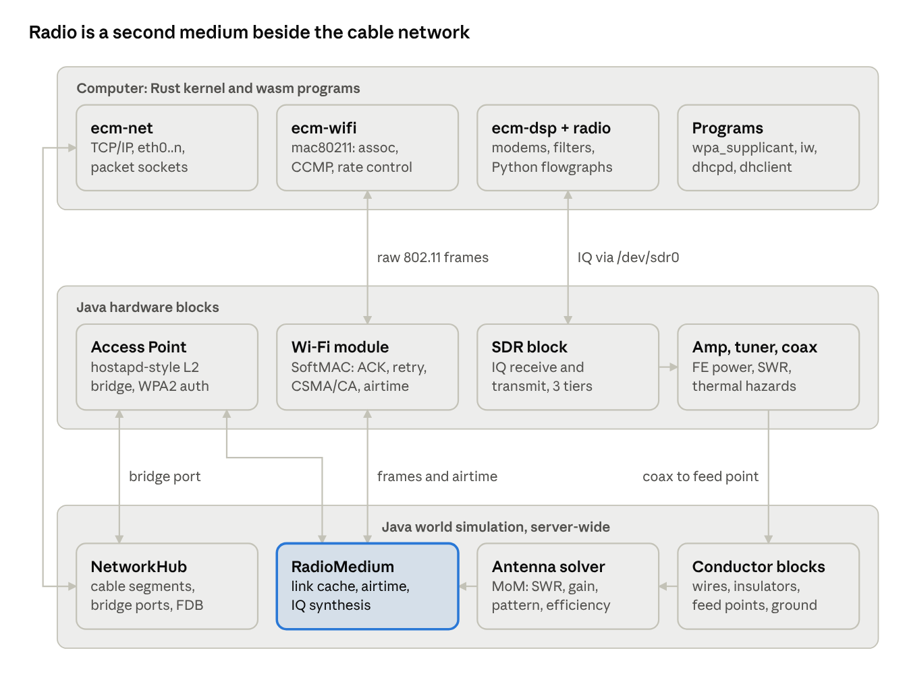
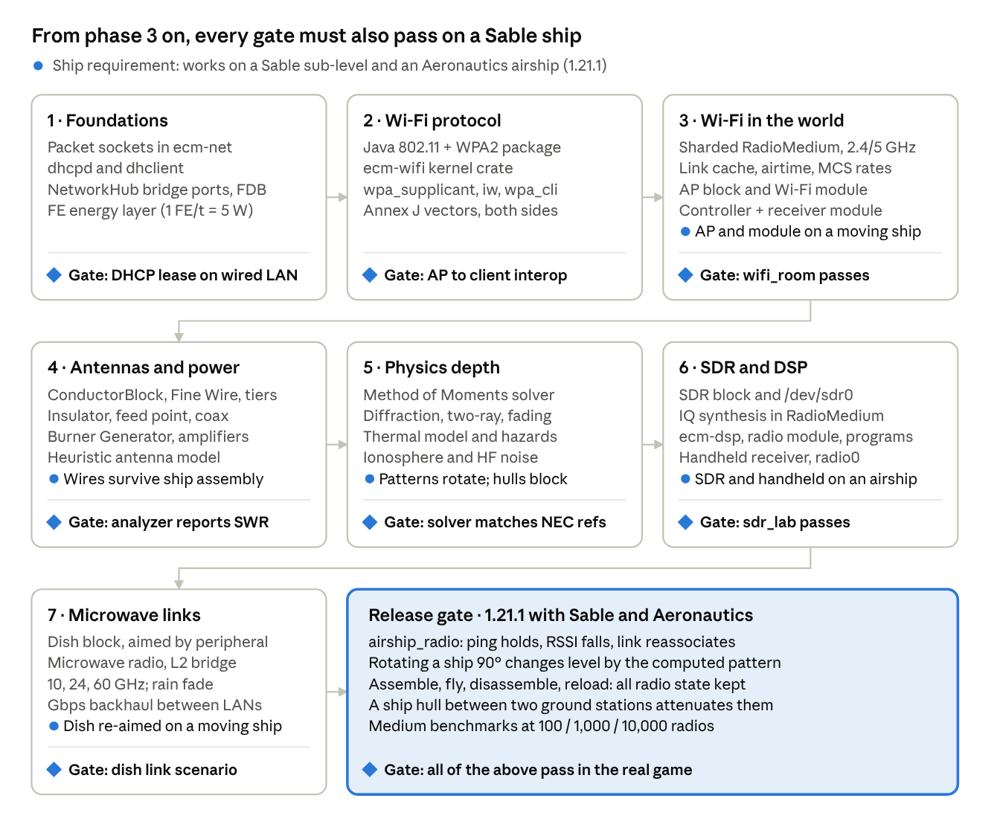

# Radio & Wireless Spec — EvansComputerMod

Oct 7, 2026 · @Evan

## Overview

This addition brings physically modelled radio to EvansComputerMod. It ranges from VLF to Wi‑Fi, uses buildable wire antennas and FE-powered amplifiers, and adds a real 802.11/WPA2 stack and a raw-IQ SDR peripheral. It sits on top of the existing wired Ethernet: radio is a second medium behind the same `NetworkHub` entry point, and the TCP/IP stack in `ecm-net` runs over it unchanged.

**Goals**

- Propagation as realistic as a playable mod allows: real wavelengths at 1 block = 1 m, link budgets, terrain, materials, weather and time of day.
- Antennas players build from blocks, whose length, gauge, height and surroundings decide how well they work.
- Real protocols: byte-accurate 802.11 + WPA2-PSK, a Rust kernel supplicant, DHCP only as programs a player runs, and pcaps that open in Wireshark.
- Raw radio for computers: an SDR block that receives and transmits IQ, with a standard DSP library so players don't start from zero.
- First-class modpack support: FE energy, data-driven tuning, common tags, configs, events.
- **Mandatory Sable and Create Aeronautics support on the 1.21.1 build** (see Sable and Create Aeronautics support). Radio on moving ships and airships is a release requirement, not a follow-up.

**Non-goals for now**

- Voice transmit from players. There is no microphone input, so the handheld is receive-only.
- Requiring power for computers. Power is introduced for radio hardware only, built so computers can adopt it later.
- DHCP built into any block. The Internet Gateway never serves DHCP.
- Any special handling for the Internet Gateway. Wireless clients get internet only if a player cables an AP into a network that reaches the gateway, exactly like a wired device.
- Mod-specific control hooks into Create Aeronautics. To control a ship by radio, players build their own receiver on board from this mod's parts.
- Hanging spans or poles. Every wire is either routed fine wire or a placed block.

**Design principles**

1. Physics produces the gameplay. No arbitrary range numbers: walls, height, wavelength and power give the result.
2. Expensive work is cached and only recomputed on change; each frame and each sample stays cheap.
3. Failures are deterministic: every hazard has a computable cause, a threshold and a warning stage. Nothing random.
4. Realism wherever it costs players nothing to understand, with config presets for the rest.

## Architecture



Kernel code (top) drives hardware blocks (middle) through host calls. The server-wide simulation (bottom) carries cable traffic in `NetworkHub` and all radio traffic in `RadioMedium`. The line on the left is today's wired path, which stays unchanged. Every new library (`ecm-wifi`, `ecm-dsp`, the Java 802.11 package, the propagation and antenna code) is pure and testable without Minecraft.

## Propagation physics

Every transmitter→receiver pair gets a link budget, and the SINR it produces decides each frame's fate. The world uses **1 block = 1 m and real wavelengths**. Diffraction, Fresnel clearance and wall penetration then differ by band with no special-casing: HF (λ ≈ 40 m) bends around hills, while 2.4 GHz (λ = 12.5 cm) is blocked by them.

```latex
P_{rx} = P_{tx} + G_{tx}(\theta,\phi) + G_{rx}(\theta,\phi) - L_{fs} - L_{obs} - L_{diff} - L_{pol} - L_{feed} - F
```

```latex
L_{fs} = 20\log_{10} d_{m} + 20\log_{10} f_{Hz} - 147.55
```

```latex
N = -174 + 10\log_{10} B + NF + N_{env} \quad\text{(dBm)}, \qquad SINR = \frac{P_{rx}}{N + \sum I_k \cdot ACI_k}
```

SINR maps through the modulation and coding in use to a bit error rate, and from that to a packet error rate. Each frame gets one deterministic-seeded roll against the packet error rate. In the SDR path, signals are summed sample by sample instead (see SDR block).

| Term | Model | Notes |
| --- | --- | --- |
| Free-space loss | Friis | Exact |
| Obstruction L\_obs | Voxel raycast; dB per block per material, scaled α(f) = α\_ref·(f/f\_ref)^k | Water absorbs heavily at 2.4 GHz; leaves cause GHz foliage loss; glass is cheap; iron and copper reflect, so iron rooms act as Faraday cages |
| Diffraction L\_diff | Knife-edge, ITU-R P.526, Deygout, up to 3 edges, over the heightmap | Fresnel radius r = √(λ·d₁·d₂/(d₁+d₂)); a 100-block 2.4 GHz link needs \~1.8 blocks of clearance |
| Path hybrid | Voxel trace for the 32 blocks nearest each end; heightmap (MOTION\_BLOCKING) in between | Walls near the antennas count exactly; terrain is cheap in the middle |
| Ground reflection | Two-ray model with ground permittivity from the block under the path | Past the crossover distance, loss goes as d⁴, so antenna height matters |
| Polarization L\_pol | Element orientation from the antenna solver | \~20 dB for vertical-to-horizontal line of sight; scrambled on skywave |
| Fading F | Rician (line of sight) or Rayleigh (no line of sight) per frame | Coherence time follows endpoint speed: static links are stable, moving players and Sable ships fade; mild by default |
| Ionosphere (MF/HF) | Day: D-layer absorption. Night: F-layer skywave with a skip zone and a MUF that follows the day/night cycle | Hop distance compressed by config (default 2–8k blocks); no skywave in the Nether or End |
| Ground and water penetration (VLF/LF) | Attenuation from skin depth of earth and water | Lets mines and underwater bases communicate at very low bitrates |
| Environmental noise N\_env | Per band: atmospheric (HF), lightning impulses during thunderstorms, rain fade above 10 GHz | Weather is Minecraft's own |

Doppler is ignored because it is negligible at Minecraft speeds, which is the realistic choice. Propagation delay is computed: it doesn't matter for packet radios, but it is applied in SDR synthesis, so ranging is possible.

## Bands and channels

Seven bands form a progression from slow, far-reaching radio to fast, short-range Wi‑Fi. All except Wi‑Fi are reached through the SDR block; Wi‑Fi uses the dedicated AP and client module.

| Band | Frequencies | Typical data rate | Gameplay role | Realistic behaviour |
| --- | --- | --- | --- | --- |
| VLF / LF | 3–300 kHz | 10–300 bps | Messages to mines and underwater bases; a world-time beacon | Penetrates ground and water; needs a huge antenna |
| MF (AM broadcast) | 0.53–1.7 MHz | Audio | Radio stations heard on handhelds | Ground wave by day, far skywave at night |
| HF | 3–30 MHz | 50 bps–1 kbps | Long-distance, ham-style links | Ionosphere follows day/night; skip zone; storm static |
| VHF | 30–300 MHz | 1.2–9.6 kbps packet, FM audio | Local packet networks, APRS-style beacons, airship comms | Line of sight; height matters most |
| UHF | 300 MHz–1 GHz | 0.3–20 kbps (LoRa-like chirp) | Long-range sensor networks, remote control of ships and drones | Chirp spread spectrum decodes at −20 dB SNR |
| Wi‑Fi 2.4 GHz | Channels 1–13, 22 MHz wide, 5 MHz spacing | 1–150 Mbps adaptive | Real IP networking via APs | Walls and water; channel overlap, so 1/6/11 is the right plan |
| Wi‑Fi 5 GHz | UNII channels, 20/40 MHz | Up to \~300 Mbps | Fast short-range networking | Worse through walls, more channels |
| Microwave link | 10–60 GHz | Gbps | Point-to-point backhaul with dishes | Precise aiming; rain fade in Minecraft rain |

Adjacent-channel interference uses each standard's spectral mask, so overlapping channels interfere partly rather than all or nothing. Wi‑Fi rate adaptation follows a real MCS table, so `iw dev wlan0 link` shows RSSI and bitrate dropping as a player walks away.

## Radio medium engine

`RadioMedium` sits beside the cable segments in `NetworkHub`. Delivering a frame never raycasts: it reads cached path loss, adds fading and interference, and rolls once against the packet error rate.

**Link cache**

- Path loss per (transmitter, receiver, band) is stored in an immutable snapshot map, published the same way `CableNetworkManager` publishes segment membership. `transmit` runs on worker threads and only reads it.
- A pair is recomputed only when an endpoint moves, its antenna changes, or a chunk section on the path changes (per-section version counters).
- Recomputation runs on a per-tick ray budget, reusing `LidarScanner`'s claim pattern, and never loads chunks.
- On unload, each chunk stores a small RF summary: column heights and average attenuation per column. Paths over unloaded chunks use it.

**Culling**

- Maximum possible range per radio = P\_tx + G\_max + G\_rx,max − sensitivity. Pairs beyond it are never considered.
- A spatial index per band keeps candidate lookups to radios on the same channel.

**Scale and parallelism**

- There is no fixed radio count to budget for: the target is **as many radios as possible**. Every stage is built to scale with cores, and nothing is capped by design.
- The medium is sharded by band and channel. Shards share no mutable state, so frame delivery, interference sums and SDR synthesis for different channels run in parallel on worker threads.
- Link-cache recompute is spread across workers. It is still bounded per tick by the ray budget, and that budget scales with the available threads.
- The hot path allocates nothing per frame: cached link-budget reads, preallocated interference accumulators, and lock-free snapshot reads.
- Inactive radios (idle, unpowered, chunk unloaded) cost nothing per tick.
- Benchmarks are run at 100, 1,000 and 10,000 radios to find where things break, not to set a limit. Regressions are tracked over time.

**Shared medium and airtime**

- Every transmission occupies its channel for preamble + bits ÷ rate on a world airtime clock (game time in ms).
- At each receiver, overlapping transmissions add as interference, weighted by channel overlap. Collisions, CSMA/CA backoff (in the Wi‑Fi low MAC), congestion and the hidden-node problem all emerge from this.
- SDR emissions count as interference to packet radios, and packet radios appear as energy to SDRs (see SDR block).

**NetworkHub changes**

- Add `transmitFromPort(portId, frame)` so bridges (the AP) can send frames whose source MAC is not their own.
- Add a forwarding table: MACs learned behind a bridge port count as on-segment, so unicast to wireless clients never leaks to the TAP bridge.

## Conductors and antennas

Antennas are built from two wire families and a few support blocks. There are **no poles and no hanging spans**. Length sets an antenna's frequency, wire gauge sets its power rating, and size relative to wavelength sets its efficiency.

**Family 1: routed fine wire** (the current Sensor Wire)

- Keeps the existing surface-following placement on the 1/16 grid. It is the only wire with routing logic.
- The display name changes to **Fine Wire**; the registry ID `evanscomputermod:sensor_wire` stays, or gets a NeoForge alias, so existing worlds keep their wires.
- Roles: signals, sensors, and small VHF/UHF antennas where 1-block segments are too coarse. It can also feed low-power antennas up to \~5 W.

**Family 2: block wires**

- One per block, nothing else can occupy the space, auto-connect on six sides. They behave like Mekanism, AE2 or Immersive Engineering cables.
- **They place like any block, floating included.** A vertical antenna is a column of rod blocks; an elevated dipole is a line of wire blocks in the air.
- A shared `ConductorBlock` base, which `NetworkCableBlock` also moves onto. They move with Sable structures as ordinary blocks.
- Waterloggable. Water around bare wire adds loss; insulated tiers are unaffected.

| Tier | Model | Collision | Rated power | Typical use |
| --- | --- | --- | --- | --- |
| Copper wire | 2 px | None | \~50 W | HF receive, low-power transmit |
| Antenna wire | 3 px | None | \~200 W | HF dipoles |
| Heavy cable | 5 px | Yes | \~2 kW | High-power HF, broadcast |
| Rod / tube | 6–8 px | Yes | \~10 kW | Self-supporting elements, verticals, Yagis |
| Lattice mast | 14–16 px, see-through | Yes, climbable | 50 kW+ | Broadcast towers where the mast is the radiator |

Visual thickness and electrical diameter are separate; the electrical values come from a data map. Material is a second axis:

- **Copper** conducts best and oxidizes like vanilla 1.21 copper, adding loss; wax prevents it.
- **Iron** is cheap and lossy.
- **Gold** is slightly lossier than copper but never corrodes.

Vanilla lightning rods, iron bars and chains count as conductors.

**Support blocks**

- **Insulator:** connects mechanically, not electrically. Used at element ends and to separate elements; rated for a maximum voltage.
- **Feed point:** a two-sided insulator with a coax port; the centre of a dipole or the base of a vertical.
- **Coax / hardline:** a `ConductorBlock` that only connects to coax, amplifiers, tuners, feed points and radios. Thin coax loses several dB per 10 blocks at UHF; hardline barely loses anything.
- **Lightning arrestor:** a grounded inline coax block.
- **Wrench:** cuts or restores a connection on one side, so parallel elements don't merge.

**Environment rules**

- Mixed tiers can join; the weakest one sets the rating and the analyzer names it.
- A conductive block touching a wire (iron, copper, another antenna) becomes part of it and detunes it.
- Ground is the first solid block below each segment, and its material sets ground quality. Water and metal roofs are good grounds; sand is poor.
- Height is real: a wire raised 10 blocks performs better, and a wire lying in the grass is lossy, though it still works as a Beverage-on-Ground style receive antenna.

**Accuracy by construction method**

| Built from | Accurate up to | Bands |
| --- | --- | --- |
| Block wires (1 m segments) | \~30 MHz | LF, MF, HF |
| Fine wire (1/16 grid) | \~500 MHz | VHF, UHF |
| Fixed antennas in items and blocks (whip, Wi‑Fi panel, dish) | n/a | Wi‑Fi, microwave, handheld |

## Antenna solver

Each antenna is analysed by a thin-wire Method of Moments solver (the NEC approach) whenever its conductor graph changes. The result is cached with the antenna, so link budgets just read a gain table.

- **Input:** the connected conductor graph from a feed point, as straight segments (block wires at 1 m; fine-wire runs split at λ/10). Each segment carries its wire radius and resistivity (from the data map), the oxidation state, an image ground plane with the quality of the ground below, and the conductive blocks touching it.
- **Solve:** an N×N complex impedance matrix (N ≤ \~200, collinear straight runs merged) on a worker thread. Milliseconds per frequency point.
- **Sweep:** across each band the antenna could serve.
- **Output per frequency:**
  - feed impedance, and so SWR against 50 Ω;
  - radiation efficiency, η = R\_rad / (R\_rad + R\_loss);
  - a gain pattern on a 5° grid, with polarization;
  - peak segment current and end voltage per watt, used by hazards and power ratings.
- **Fallback:** above the segment cap, or while a result is pending, a heuristic classifier (dipole, monopole, loop, long wire) gives approximate values.
- **Emergent designs:** a Yagi, a loop or an inverted-V is never special-cased. Correct geometry produces the gain; bad geometry underperforms.

Player-facing tools read this cache:

- an **antenna analyzer** item or program that plots SWR across a band on a display;
- an `antenna` command for impedance, SWR, efficiency, power limit and polar plots;
- a Jade tooltip, e.g. "Resonant at 7.1 MHz · 2:1 SWR band 6.9–7.3 MHz · rated 200 W (wire) / 1.4 kW (insulators)".

## Power

Radio hardware is the mod's first powered equipment. It uses the NeoForge FE capability, so any power mod can supply it. The energy layer is written so computers can adopt it later without changes.

**Signal chain**

```
Computer ─ SDR block / Wi‑Fi module (exciter, ≤ 5 W, unpowered)
         ─ coax ─ [Power Amplifier, FE] ─ coax ─ [Tuner] ─ [Lightning arrestor] ─ feed point ─ antenna
```

**Burner Generator**

- Accepts every furnace fuel through the `neoforge:furnace_fuels` data map (`stack.getBurnTime(RecipeType.SMELTING)`), so modded fuels and pack changes apply automatically.
- Deliberately weak: 20–40 FE/t, about furnace efficiency. Enough for a 100 W amplifier and little more, so packs' power mods stay the better choice.
- Always registered; it can be disabled by server config (see Modpack compatibility).

**Power Amplifier**

- Tiers of 100 W, 1 kW and 10 kW RF output, about 50% efficient: FE drawn ≈ 2 × RF out, and the rest is waste heat.
- **Conversion: 1 FE/t = 5 W of DC input** (server config `power.wattsPerFePerTick`). At this rate the tiers draw 40, 400 and 4,000 FE/t while transmitting. A Burner Generator (20–40 FE/t) can just run the 100 W tier, the 1 kW tier needs a real power mod, and 10 kW is a serious build. Exciters (≤ 5 W) need no FE.
- Draws power **only while transmitting**, measured by airtime on the radio medium. A busy packet node costs more than an idle beacon at the same power.
- When FE supply runs short, it browns out: output power drops, with no damage.
- Reflected power from SWR is handled per tier: the higher tiers fold back and log a warning, while the cheap tier has no protection (see Hazards).

**Feedline and tuner**

- Coax loss depends on tier, frequency and length. Excess power heats it.
- The tuner matches impedance so the amplifier sees a good SWR. It cannot fix an inefficient antenna: on a short HF whip, the loss moves into the tuner.

**Balance comes from physics**

- Range grows with √P in free space and roughly ⁴√P past the two-ray crossover, so 100× power gives 10× or \~3× range.
- Antenna gain helps both directions; power only helps transmit. A 10 kW station can be heard by a handheld that can't answer it, which pushes players toward good antennas at both ends.
- A high-power transmitter desensitises nearby receivers, including its own operator's, which encourages separating stations.
- On HF, atmospheric noise limits the benefit of more power.

## Hazards

Hazards only happen when something is predictably set up wrong. Each one follows the same contract: **a computable cause → a fixed threshold → a visible warning stage → a predictable consequence.** No dice rolls are involved.

**Thermal model.** Every wire, coax block, insulator and amplifier has a temperature. Each tick it integrates heat in (I²R or dissipated watts) minus cooling, over transmit time. A short overload burst survives and a sustained one fails, after a time that can be stated exactly ("fails after 12 s of continuous 1 kW").

| Mistake | Computed from | Warning stage | Consequence |
| --- | --- | --- | --- |
| Wire too thin for the power | Segment current from the solver vs. the wire's current rating, through the thermal model | Glow tint at 70%, then a sizzle sound | The hottest segment melts and drops as scrap |
| Missing or undersized insulators | End voltage vs. insulator rating | Corona particles and crackle | Arcing and amplifier foldback; fire only if a flammable block is within the arc radius |
| Transmitting into no antenna or a bad match | Reflected power from SWR vs. amplifier tolerance | Amplifier shows high SWR and limits output | Protected tiers fold back; the unprotected cheap tier burns out |
| Coax too thin for power and frequency | Feedline loss × power, as heat per block | The coax block warms | The coax melts |
| FE supply too small | FE demand vs. supply | Brownout | Output drops; no damage |
| Standing at a high-power element while it transmits | Field strength at the player's position vs. an exposure limit | RF meter reading, hum, screen tint | Damage over time, only while transmitting |
| Ungrounded tall antenna in a storm | Vanilla's lightning-rod targeting | Tooltip: "no lightning arrestor" | Ungrounded: the strike destroys the amplifier or radio down the coax. Grounded: nothing. |

Lightning is the only case involving chance, and that chance is vanilla weather. Whether the station survives is fully determined by the build.

**Inspectable before it fails.** The analyzer and Jade tooltip name the weakest link, e.g. "Limited to 640 W by insulator at (12, 80, −4); wire rated 2 kW; amp 1 kW → will arc."

**Multiplayer safety**

- Hazard level is a gamerule (default set in server config):
  - `off`: warnings only;
  - `equipment` (**default**): only player-built radio parts can break, with no fire and no player damage;
  - `full`: adds fire and RF exposure.
- Lightning damage has its own toggle. Fire also respects `doFireTick`.
- World changes (melting, fire) go through `BlockEvent`s using a fake player owned by the antenna's placer, so claim mods (FTB Chunks, Open Parties and Claims) can cancel them. Nobody can grief a neighbour by overpowering an antenna on a claim border.

## Wi‑Fi access point

The Access Point is a block with a built-in antenna, placed directly on a network cable. It is a **layer-2 bridge** implemented in Java, effectively `hostapd`. It doesn't route or process IP: ARP, IP and DHCP pass through it untouched, so clients use static addresses or a DHCP server some player runs on the wired LAN.

The AP has **no special handling for the Internet Gateway**. Wireless clients reach the internet only if the AP's cable network reaches a gateway, the same way a wired computer does.

**Protocol (byte-accurate IEEE 802.11 + WPA2-PSK)**

1. **Beacons** every 102.4 ms with SSID, channel and RSN IE (WPA2/CCMP). Delivered only to radios that are scanning or associated; they count toward airtime.
2. **Probe request / response** for active scans; hidden SSIDs answer only directed probes.
3. **Authentication** (Open System, two frames).
4. **Association** request / response, assigning an AID.
5. **EAPOL 4-way handshake** (EtherType 0x888E):
   - M1: the AP sends ANonce.
   - M2: the station sends SNonce + MIC. A wrong password fails here.
   - M3: the AP installs the PTK and sends the GTK wrapped with AES key wrap, plus a MIC.
   - M4: the station acknowledges.
6. **Data** with AES-CCMP: a per-client TK for unicast, the GTK for broadcast and multicast, a 48-bit packet number for replay protection, and an LLC/SNAP header carrying the EtherType.
7. **Maintenance:** retries and timeouts, deauthentication and disassociation, inactivity timeout, GTK rekey, and roaming across APs that share an SSID and passphrase.

Key derivation: PMK = PBKDF2-HMAC-SHA1(passphrase, SSID, 4096, 256 bits); PTK = PRF-384(PMK, "Pairwise key expansion", min/max MAC ‖ min/max nonce), split into KCK, KEK and TK. WPA3-SAE may come later.

**Bridging**

- **Downlink:** the AP is a promiscuous bridge port on the cable segment. A frame for an associated client is wrapped (FromDS), encrypted with that client's TK and sent on the radio medium. Broadcast and multicast go out under the GTK.
- **Uplink:** decrypt, check the packet number, rebuild the Ethernet header and send with the client's source MAC through `transmitFromPort`.
- Client-to-client traffic is relayed by the AP unless client isolation is on.
- Associations fill the bridge's forwarding table in `NetworkHub`.

**Block**

- GUI settings: SSID, hidden SSID, security (Open / WPA2-PSK), passphrase, channel (auto, 1/6/11, 5 GHz), transmit power, client isolation, MAC filter.
- Status page: associated clients with RSSI, data rate, handshake state and last error.
- The passphrase is stored server-side only and **never included in the block-entity sync packet**. Only the owner, or someone with claim permission, can open the config. Sneak + wrench does a factory reset.
- The antenna position is the block's position, so placement height and surrounding walls matter.
- Later: PoE power from a PoE switch or injector once power comes to networking.

**Code layout:** the 802.11 framing and WPA2 crypto are a Java package with **no Minecraft dependencies**, using JDK crypto primitives, so they can be unit-tested on their own.

## Wi‑Fi client

The client side copies Linux's split: a SoftMAC card in Java, a mac80211-style stack in the Rust kernel, and `wpa_supplicant` in userspace. The 802.11/WPA2 protocol is deliberately implemented twice (Java AP, Rust client) for realism. Shared test vectors and cross-implementation tests keep the two compatible.

| Layer | Linux equivalent | Implementation | Responsibilities |
| --- | --- | --- | --- |
| Wi‑Fi module (module bay) | NIC firmware / low MAC | Java | ACKs, retransmissions, CSMA/CA backoff, FCS, airtime, channel tuning, RX filter. Only timing-critical work. |
| `ecm-wifi` crate | mac80211 + cfg80211 | Rust, pure and host-testable like `ecm-net` | Frame building and parsing, scan / auth / assoc state machine, CCMP encrypt and decrypt with installed keys, rate control (minstrel-style), presents `wlan0` to `ecm-net` as an Ethernet interface |
| `wpa_supplicant` | wpa\_supplicant | wasm program | EAPOL 4-way handshake via a packet socket on 0x888E, PMK/PTK derivation, installs keys into the kernel, network selection and roaming |
| Tools | iw, wpa\_cli | wasm programs | `iw dev wlan0 scan`, `iw dev wlan0 link` (RSSI, bitrate), `iw dev wlan0 set type monitor`, `wpa_cli` for networks and status |

**Host ABI for the module (SoftMAC)**

- `wifi_tx_frame(raw_80211, rate, power)`
- `wifi_rx_frame()` → `(raw_80211, rssi, rate, channel, timestamp)`, radiotap-style metadata
- `wifi_set_channel`, `wifi_set_rx_filter` (BSSID / promiscuous / monitor)
- `wifi_install_key` (optional, later): hardware CCMP offload if software AES in wasm is too slow at high data rates. Software CCMP in the kernel comes first.

**Monitor mode:** the module passes every frame up with radiotap headers, so `tcpdump` writes pcaps that real Wireshark decodes, and decrypts if given the passphrase. Because the crypto is real, captured handshakes can be dictionary-attacked, so a weak password really is weak.

**Crypto crates:** the workspace already has `sha2` and `hmac`. Add RustCrypto `aes`, `ccm`, `sha1`, `pbkdf2` and `aes-kw`; all are pure Rust and compile to wasm. PBKDF2 with 4096 iterations is \~8k SHA-1 compressions, which takes milliseconds even on Chicory.

## Packet sockets and DHCP

DHCP exists **only** as programs a player chooses to run; no block ever serves addresses, including the Internet Gateway. Static addressing with `ifconfig` and `ip addr` keeps working as it does today. Today there is no DHCP anywhere in the mod.

**Packet sockets in `ecm-net`**

- An `AF_PACKET`-style socket bound to an interface and an EtherType, sending and receiving whole Ethernet frames.
- It unlocks three programs:
  - `wpa_supplicant`: EAPOL frames on 0x888E.
  - `dhclient`: broadcasts from 0.0.0.0 before it has an address.
  - `dhcpd`: answers on any interface without a full IP configuration for each client.
- `tcpdump` can move onto it later instead of the pcap host calls.

**`dhcpd`** (wasm program)

- Pools per interface, leases with expiry, static reservations by MAC, and options for router, DNS and lease time.
- Leases are persisted to the computer's filesystem.
- Implements DISCOVER/OFFER/REQUEST/ACK, plus NAK, RELEASE and DECLINE.

**`dhclient`** (wasm program, also `ifconfig <iface> dhcp`)

- Full client state machine: INIT, SELECTING, REQUESTING, BOUND, RENEWING, REBINDING.
- Applies the address, default route and DNS (through `resolvectl`).
- Works the same over `eth*` and `wlan0`, since the AP only bridges.

## SDR block

The SDR block is a computer peripheral with a coax port that **receives and transmits raw complex IQ samples**: an in-game RTL-SDR or HackRF. All non-Wi‑Fi radio goes through it, and any modulation a player writes works end to end.

**Signal synthesis (receive)**

```latex
rx[n] = \sum_k g_k \, h_k[n] \, \mathrm{shift}\big(tx_k[n - \tau_k],\ f_k - f_{rx}\big) + w[n]
```

- g\_k is the amplitude from the cached link budget, including both antennas' pattern gain. h\_k is the fading phasor, τ\_k the propagation delay, and w the noise: thermal, atmospheric and lightning.
- **SDR transmitters** contribute their own IQ, resampled to the receiver's rate and shifted to its centre frequency.
- **Packet-level emitters** (Wi‑Fi, AP beacons) contribute band-limited noise bursts at the right power, bandwidth and airtime. They look correct on a waterfall but can't be decoded.
- Interference, collisions, adjacent-channel splatter and desense arise without special cases. In reverse, SDR transmissions count as interference on the packet-level medium, so an SDR can jam Wi‑Fi.

**Timing and cost**

- Samples run on a world sample clock (tick × sample rate), so the stream stays continuous in sample time even when the server lags. Buffer latency is about one tick.
- Only active SDRs do any work, about samples × in-band emitters, on a worker thread. Emitters more than 10 dB below the noise floor are skipped.
- If the program reads too slowly, samples are dropped and `sdr_overflow` fires. If it writes too slowly when transmitting, the transmitter emits silence and `sdr_underflow` fires.

**Hardware tiers and realism**

| Tier | Tuning range | Max sample rate | ADC / DAC | Transmit |
| --- | --- | --- | --- | --- |
| Basic | 0.5–1700 MHz | 48 kS/s | 8-bit | No |
| Standard | 10 kHz–6 GHz | 250 kS/s | 12-bit | Yes, ≤ 5 W exciter |
| Advanced | 1 kHz–6 GHz | 1 MS/s (wasmtime only) | 16-bit | Yes, ≤ 5 W exciter |

These rates are confirmed. Basic is audio rate and enough for AM, NBFM, SSB and packet, and it runs comfortably on Chicory. Standard covers WBFM and several channels at once. On Chicory the Advanced tier is capped at 250 kS/s and reports that cap through `set_sample_rate`. All caps are server config.

- Manual gain or AGC. Too much gain near a strong signal clips, and ADC depth sets the dynamic range.
- Simulation preset only: oscillator ppm error and drift, DC spike, IQ imbalance.
- Transmit goes through the amplifier → coax → antenna chain, with its power limits and hazards. Transmit power is capped per tier, and transmission is subject to claim rules.

**Computer interface**

- `/dev/sdr0` following the `/dev/audio` pattern: read and write interleaved `cs16` or `cf32`.
- Peripheral methods: `set_frequency`, `set_sample_rate`, `set_gain` / `set_agc`, `set_bandwidth`, `tx_enable`, `timestamp()` (a sample counter for syncing receive and transmit).
- Events: `sdr_overflow`, `sdr_underflow`.

## DSP libraries and programs

These are the in-game equivalents of GNU Radio and liquid-dsp. The heavy per-sample work runs in Rust; Python wires blocks together, because RustPython has no numpy.

**`ecm-dsp` (Rust crate, pure, host-testable)**

- Basics: complex types, FFT, windows, FIR and IIR design, polyphase resampling and decimation, NCO and mixer.
- Synchronization: AGC, squelch, PLL, Costas loop, symbol timing recovery (Gardner, Mueller–Müller), frequency-offset estimation.
- Modems: AM, NBFM/WBFM, SSB, CW/OOK, FSK/AFSK, BPSK/QPSK, LoRa-style chirp, each with matching modulator and demodulator.
- Coding and framing: CRCs, Hamming, convolutional + Viterbi, Reed–Solomon, HDLC/AX.25, KISS.
- Analysis: PSD and waterfall helpers, SNR estimation.

**`radio` Python module (flowgraphs)**

```python
import radio
sdr = radio.open("sdr_0")
sdr.tune(146.52e6, rate=48_000)
fg = radio.Flowgraph(sdr >> radio.fm_demod(5e3) >> radio.lowpass(3e3) >> radio.speaker())
fg.run()
```

**Ready-made programs**

| Program | Purpose |
| --- | --- |
| `rx_fm`, `rx_am`, `rx_ssb` | Listen to a frequency through the Speaker |
| `waterfall` | Live spectrum and waterfall on a display |
| `scan` | Step across a band, logging active frequencies |
| `tx_tone` | Transmit a test tone, e.g. for antenna tuning |
| `afsk1200` | 1200-baud packet modem (APRS-style) |
| `radio_station` | Broadcast an audio file as AM or FM for handhelds |
| `iqrec` / `iqplay` | Record and replay IQ as `.cf32` / `.cs16` with SigMF metadata, readable by inspectrum, GQRX and Universal Radio Hacker |

**`radio0` network interface:** a KISS-TNC style bridge turns a packet modem into an IP interface in `ecm-net`, so `ping` and `ssh` run over slow VHF packet radio.

## Handheld receiver

The handheld radio is a **receive-only** item. A transmitter would need microphone input, which is out of scope.

- Bands: AM broadcast, shortwave (HF) and VHF FM, with a built-in telescopic whip antenna model.
- UI: frequency dial, band switch, signal meter, scan, volume, squelch.
- The server computes the link budget at the player's position and demodulates there. It streams audio to that player with noise matching the SNR, reusing the Speaker's PCM streaming, so weak stations hiss and fade.
- What it hears: computers broadcasting audio such as music, generated speech or beeps through an SDR block, e.g. with `radio_station`, plus natural noise and static.
- Only stations the player's handheld is tuned to are synthesized, and only while it is held and switched on.

## Wireless controller on 2.4 GHz

The existing Wireless Xbox Controller (`controller/` package, branch `claude/quirky-meitner-55pg0t`) moves onto the 2.4 GHz radio medium and **shares spectrum with Wi‑Fi**.

**What's wrong today:** `ControllerServer.handleInput` checks a straight-line distance against `EcmConfig.controllerRange()`. That is an arbitrary range number, which breaks design principle 1: walls, water and other 2.4 GHz traffic have no effect.

**Fix**

- The controller is a low-power 2.4 GHz transmitter (about 0 dBm, small built-in antenna). Each input report it sends is a short frame on the radio medium. It takes airtime, suffers interference, and counts as interference to nearby Wi‑Fi.
- The computer needs a receiver to hear it: a **2.4 GHz transceiver module** in a module bay. **Both are provided:** the Wi‑Fi module has a controller mode, and a cheaper dedicated Controller Receiver module does only this. The module's position is the receive antenna, so walls and height matter.
- Delivery uses the normal link budget and packet error rate. `EcmConfig.controllerRange()` and the distance check are removed.
- Lost frames are handled the way real pads handle them: the last state is held briefly, then input goes to neutral after the existing 2 s timeout. The HUD status shows signal strength and "No signal" instead of "Out of range".
- Pairing (right-click a Terminal) still stores the computer ID on the item. Pairing to a computer without a receiver module says that a receiver is needed.
- The packet-level path is used (no IQ), so cost stays per frame. An SDR sees controllers as bursts on the waterfall.

## Microwave links

Point-to-point microwave backhaul is **part of this addition**.

- **Dish block:** a multiblock parabolic dish (1×1, 2×2 or 3×3 face). Gain is G = η(πD/λ)² with η ≈ 0.55, and beamwidth follows. The dish is aimed by yaw and pitch, set in its GUI or by a peripheral, so a computer can align it.
- **Microwave radio:** a block that sits on a network cable and connects by coax to a dish. Like the AP, it is a **layer-2 bridge**: two radios linked by aligned dishes join their cable segments into one, at Gbps-class rates.
- **Bands:** 10, 24 and 60 GHz. Above 10 GHz Minecraft rain adds rain fade, and 60 GHz adds oxygen absorption, so it suits only short hops.
- **Physics:** aiming error comes off the dish pattern, and Fresnel clearance matters at long range. Line of sight is effectively required, and leaves and water block it.
- Microwave links work on Sable sub-levels and airships, so a moving ship loses alignment unless a computer keeps re-aiming the dish.
- The SDR does not cover these bands, since all tiers stop at 6 GHz.

## Modpack compatibility

Everything a pack might tune is data, config or a hook. Nothing requires code changes, and no block is ever unregistered: KubeJS can't remove registered blocks, and doing so would break existing worlds.

**Disabling the Burner Generator** (the standard pattern for any optional block)

- The block is always registered.
- Server config `power.burnerGenerator.enabled` controls:
  - the recipe, through a custom NeoForge recipe condition (`ICondition`) that reads the config;
  - visibility: left out of the creative tab and added to `c:hidden_from_recipe_viewers`, so JEI and EMI hide it;
  - behaviour: existing generators stop producing and show "disabled by server config".
- KubeJS users can still do it in script: `event.remove({output: 'evanscomputermod:burner_generator'})`.

**Data-driven tuning**

| Data | Mechanism |
| --- | --- |
| RF loss per material (dB per block, frequency exponent) | Block data map `evanscomputermod:rf_attenuation`; modded blocks without an entry fall back by material and sound type |
| Conductors, insulators, ground quality | Block tags `#evanscomputermod:rf_conductors`, `#rf_insulators`, `#rf_good_ground`, seeded from `c:` tags such as `#c:storage_blocks/copper` |
| Wire and coax tiers (radius, resistivity, current and voltage ratings) | Block/item data map |
| Amplifier tiers, generator output, sample-rate caps, distance compression | Server config (synced) |
| Hazard level, lightning damage | Gamerules, with defaults in server config |
| Realism preset (arcade / realistic / simulation) | Server config |

**Integration**

- **Energy:** only the FE capability, on every sensible face. No custom unit and no converters.
- **Recipes:** common tags (`#c:ingots/copper`, `#c:plates/...`, `#c:wires/copper`), so Immersive Engineering and Create materials fit automatically.
- **Capabilities:** antenna, amplifier and radio capabilities so other mods can add their own hardware.
- **Events:** `AntennaOverloadEvent`, `RadioTransmitEvent` and `HazardEvent` on the NeoForge bus, cancellable. KubeJS hooks them through `NativeEvents`.
- **Tooltips and docs:** Jade/WTHIT providers for SWR, power, temperature and why something isn't working; JEI/EMI info pages.
- **Stable IDs:** never renamed after release; aliases where unavoidable (e.g. Sensor Wire).

**Config placement:** startup/common config only for anything that affects registration, which should be almost nothing. All gameplay settings go in server config, synced to clients.

## Sable and Create Aeronautics support (1.21.1, required)

Every part of this addition **must work on Sable sub-levels and on Create Aeronautics airships in the 1.21.1 build**. This is a hard requirement for shipping, not an optional integration. Reference sources for both mods are in `D:\MinecraftMods\CreateAddonReferences`:

| Mod | Mod ID | Source |
| --- | --- | --- |
| Sable 2.0.5 (physics, sub-levels) | `sable` | `CreateAddonReferences\sable` |
| Create Aeronautics | `aeronautics` | `CreateAddonReferences\Simulated-Project\aeronautics` |
| Create Simulated (shared base for Aeronautics) | `simulated` | `CreateAddonReferences\Simulated-Project\simulated` |
| Create 6.0.10 | `create` | `CreateAddonReferences\Create` |

**Build integration**

- Same pattern the mod already uses for Sable and Create: `compileOnly` on 1.21.1, all touching code behind stonecutter guards, so 26.1 still builds without them.
- Both stay soft dependencies at runtime: the mod loads and radio works on plain 1.21.1 without them. When they are present, everything below is required to work.
- Dev runs and `Test.ps1` stage Sable and Aeronautics (with Create and Simulated) into the 1.21.1 run so the gates below are tested in the real game.

**Sable sub-levels**

- **Positions and orientation:** every radio endpoint (AP, Wi‑Fi module host, SDR, feed point, handheld holder standing on a ship) resolves to world coordinates through the sub-level's current transform. Antenna gain patterns and polarization are rotated by the sub-level's orientation, so a tilting ship really changes coverage.
- **Link cache:** a sub-level moving or rotating past a threshold (configurable, e.g. 0.5 blocks or 2°) counts as an endpoint move and invalidates its pairs. Recompute is rate-limited per sub-level so a fast ship can't eat the whole ray budget; between recomputes, link budgets interpolate from the last result plus free-space delta.
- **Fading:** coherence time uses the sub-level's linear and angular velocity, as the propagation table already states.
- **Obstruction:** voxel raycasts include blocks of every sub-level the ray crosses, transformed into sub-level space, not only world blocks. A ship's own hull shadows its antenna, and another ship between two stations attenuates the link. The heightmap middle segment ignores sub-levels except through a bounding-box test that switches that span back to voxel tracing.
- **Antenna solver:** runs in the sub-level's local frame, so a rigid ship's antennas never need re-solving while it moves. Ground is the first solid block below each segment *within the sub-level*, so a metal hull acts as a counterpoise; when there is no sub-level block below, the antenna is treated as free-space with no ground plane (high-altitude airship).
- **Conductors and cables:** `ConductorBlock` wires, coax and `NetworkCableBlock` segments keep their connections and network membership when blocks are assembled into or disassembled from a sub-level. Conductor graphs never connect across a sub-level boundary, so a ship cannot weld itself to a ground antenna.
- **Hazards and world edits:** melting, arcing and fire act on sub-level blocks through the same claim-aware `BlockEvent` path. RF exposure uses the player's position relative to the element in world space.
- **Persistence:** block-entity state (AP config and passphrase, SDR settings, amplifier temperature) survives assemble/disassemble and save/load on a sub-level. Wi‑Fi clients re-associate automatically after a ship is reassembled.

**Create Aeronautics airships**

- Airships are Sable sub-levels assembled by Aeronautics, so everything above applies. On top of that:
- **RF data:** `rf_attenuation` and conductor/insulator tags gain entries for Aeronautics and Simulated blocks (envelopes and balloon fabric are nearly transparent, metal frames reflect and can act as counterpoise), shipped as optional data that loads only when the mods are present.
- **Altitude:** airships are the natural VHF/UHF line-of-sight platform. Above the world heightmap the middle-path diffraction is skipped, and two-ray ground reflection uses the terrain under the path rather than the ship.
- **Power:** amplifiers on an airship take FE from whatever the ship carries; no Aeronautics-specific power path is required.
- **Gameplay targets that must work:** ship-to-ground and ship-to-ship VHF packet and Wi‑Fi, an AP on an airship serving players on board, an SDR on an airship receiving ground stations, and handhelds used on a moving airship.
- **Remote control is player-built, never a hook.** This mod adds no integration with Aeronautics flight controls. To fly a ship by radio, a player puts a computer with an SDR or radio module on board, runs their own receiver program, and drives the ship's controls through the existing redstone and peripheral paths (e.g. Create Redstone Link).

**Gates (1.21.1)**

- `/ecm scenario spawn airship_radio`: an Aeronautics airship with an AP and a computer, flying away from a ground computer. Ping holds within range, RSSI and bitrate fall with distance, and the link drops and reassociates as the ship leaves and returns.
- Sable sub-level test: rotate a ship carrying a dipole 90° and confirm the received level changes by the computed pattern and polarization loss.
- Assemble → fly → disassemble → reload: AP config, conductor graphs and cable networks survive unchanged.
- A ship hull between two ground stations measurably attenuates their link.

## Testing

Every physics and protocol component is a pure library tested against published reference numbers before it touches Minecraft.

| Area | Test | Where |
| --- | --- | --- |
| WPA2 crypto | IEEE 802.11 Annex J vectors (PBKDF2, PRF, CCMP, AES key wrap), identical in both languages | JUnit + `cargo test -p ecm-wifi` |
| AP ↔ client interop | Java AP + real kernel + `wpa_supplicant`: associate, handshake, DHCP across the bridge, ping | `KernelHostIntegrationTest` style |
| Negative protocol cases | Wrong password fails at the M2 MIC; replayed packet number dropped; lost M3 retransmitted; deauth handled | Both suites |
| Frame formats | Golden pcaps both sides parse and produce byte-for-byte; checked once in Wireshark | Fixtures in repo |
| DHCP | Full client and server state machines, lease expiry, NAK paths | netsim harness with a virtual clock |
| Propagation | Friis, two-ray, knife-edge against ITU-R P.526 worked examples; material table sanity | JUnit |
| Antenna solver | Half-wave dipole ≈ 73 Ω and 2.15 dBi; quarter-wave monopole ≈ 36 Ω; Yagi gain vs. NEC reference designs | JUnit |
| DSP | Modem round trips (modulate → channel → demodulate) at stated BER vs. SNR; filter responses | `cargo test -p ecm-dsp` |
| Hazards | Thermal model time-to-failure is exact and reproducible for given inputs | JUnit |
| Medium performance | 100 / 1,000 / 10,000 radios; scaling with worker threads; no raycasts or per-frame allocation on the hot path | Benchmark test |
| Wireless controller | Range follows the link budget (a wall reduces it, a busy Wi‑Fi channel causes drops); no receiver module means no input | Scenario + JUnit |
| Microwave link | Dish gain and beamwidth vs. formula; misaimed dish loses the link; rain fade at 24 GHz | JUnit + scenario |
| End to end | `/ecm scenario spawn wifi_room`, `ham_station`, `sdr_lab` building working setups | Scenario command |

## Roadmap



| Phase | Contents | Ship requirement (Sable + Aeronautics) | Gate |
| --- | --- | --- | --- |
| 1 · Foundations | Packet sockets in `ecm-net`; `dhcpd` and `dhclient`; NetworkHub bridge ports and forwarding table; FE energy layer (1 FE/t = 5 W) | — | DHCP lease on wired LAN |
| 2 · Wi‑Fi protocol | Java 802.11 + WPA2 package; `ecm-wifi` kernel crate; `wpa_supplicant`, `iw`, `wpa_cli`; Annex J vectors on both sides | — | AP ↔ client interop test |
| 3 · Wi‑Fi in the world | Sharded `RadioMedium` for 2.4/5 GHz; link cache, airtime, MCS rates; AP block and Wi‑Fi module; controller on 2.4 GHz + receiver modules | AP and module on a moving ship | `wifi_room` passes |
| 4 · Antennas and power | `ConductorBlock`, Fine Wire, wire tiers; insulator, feed point, coax; Burner Generator, amplifiers; heuristic antenna model | Wires survive ship assembly | Analyzer reports SWR |
| 5 · Physics depth | Method of Moments solver; diffraction, two-ray, fading; thermal model and hazards; ionosphere and HF noise | Patterns rotate with the ship; hulls block | Solver matches NEC references |
| 6 · SDR and DSP | SDR block and `/dev/sdr0`; IQ synthesis in `RadioMedium`; `ecm-dsp`, `radio` module, programs; handheld receiver, `radio0` | SDR and handheld on an airship | `sdr_lab` passes |
| 7 · Microwave links | Dish block aimed by peripheral; microwave radio (L2 bridge); 10/24/60 GHz with rain fade; Gbps backhaul between LANs | Dish re-aimed on a moving ship | Dish link scenario passes |
| **Release gate (1.21.1)** | `airship_radio` scenario; 90° ship rotation changes level by the computed pattern; assemble → fly → disassemble → reload keeps all radio state; ship hull attenuates a ground link; medium benchmarks at 100 / 1,000 / 10,000 radios | All of it, with Sable and Aeronautics installed | All pass in the real game |

Phases 1–2 are pure libraries and kernel work that pay off on wired networks right away. Wi‑Fi is playable at the end of phase 3, before any antenna building exists. Each gate is an automated test or scenario, so a phase is done only when it works end to end.

From phase 3 on, each phase's gate must also pass on a Sable sub-level and an Aeronautics airship. Nothing ships until the release gate passes on 1.21.1 with both mods installed.

## Decisions (resolved open questions)

- **Server scale:** no fixed target. Support as many radios as possible, sharded and parallel (see Scale and parallelism).
- **Internet Gateway:** no special handling. Wireless internet means cabling an AP into a network that reaches a gateway.
- **SDR tiers:** 48 kS/s / 250 kS/s / 1 MS/s, with Advanced capped to 250 kS/s on Chicory; all config-tunable.
- **Sensor Wire rename:** Fine Wire (registry ID unchanged or aliased).
- **FE ↔ watts:** 1 FE/t = 5 W of DC input, configurable.
- **Wireless controller:** moves onto the 2.4 GHz medium; the fixed config range is removed; the computer needs a 2.4 GHz receiver module.
- **Microwave dish links:** in this addition.
- **Controller receiver:** both. The Wi‑Fi module gets a controller mode, and there is also a cheaper dedicated Controller Receiver module.
- **Roadmap:** seven phases plus a release gate; Sable/Aeronautics requirements sit in every phase from 3 on.
- **Remote control of airships:** no Aeronautics control hook; players build their own on-board receivers from this mod's parts.
